# CI/CD Testing Documentation

## Overview

This document explains the automated testing workflows in the RrishMusic CI/CD pipeline, how to understand test results, troubleshoot failures, and configure automated testing for optimal development workflow.

## GitHub Actions Workflows

### Test Workflow Architecture

```mermaid
graph TD
    A[Code Push/PR] --> B[GitHub Actions Trigger]
    B --> C[Setup Environment]
    C --> D[Install Dependencies]
    D --> E[Type Checking]
    E --> F[Code Linting]
    F --> G[Unit Tests]
    G --> H[Build Application]
    H --> I[E2E Tests]
    I --> J[Performance Tests]
    J --> K[Generate Reports]
    K --> L[Deploy Artifacts]
    L --> M{All Pass?}
    M -->|Yes| N[✅ Success]
    M -->|No| O[❌ Failure]
    O --> P[Block Merge]
    N --> Q[Allow Merge]
```



## Workflow Files

### 1. Main Test Workflow (`.github/workflows/test.yml`)

**Triggers:**
- Push to `main` branch
- Pull requests to `main` branch

**Steps:**
```yaml
name: Test Suite
on:
  pull_request:
    branches: [main]
  push:
    branches: [main]

jobs:
  test:
    runs-on: ubuntu-latest
    steps:
      - name: Checkout code
      - name: Setup Node.js 20
      - name: Install dependencies (npm ci)
      - name: Run type checking
      - name: Run linting
      - name: Run unit tests
      - name: Build project
      - name: Upload test results
```

**What it validates:**
- ✅ TypeScript compilation
- ✅ Code style compliance (ESLint)
- ✅ Unit and integration tests (189 tests)
- ✅ Application builds successfully
- ✅ Test coverage reporting

### 2. E2E Test Workflow (`.github/workflows/e2e-tests.yml`)

**Triggers:**
- Push to `main` or `develop` branches
- Pull requests to `main`
- Manual workflow dispatch

**Browser Matrix:**
```yaml
strategy:
  matrix:
    browser: [chromium, firefox, webkit]
```

**Steps:**
```yaml
name: E2E Tests
jobs:
  test:
    strategy:
      matrix:
        browser: [chromium, firefox, webkit]
    steps:
      - name: Checkout code
      - name: Setup Node.js 18
      - name: Install dependencies
      - name: Install Playwright browsers
      - name: Build application
      - name: Start preview server
      - name: Run E2E tests
      - name: Upload test results
```

**What it validates:**
- ✅ Cross-browser compatibility (Chrome, Firefox, Safari)
- ✅ User workflows and interactions
- ✅ Mobile responsiveness
- ✅ Performance in real browsers
- ✅ Accessibility compliance

### 3. Performance Test Workflow (`.github/workflows/performance-testing.yml`)

**Triggers:**
- Scheduled runs (weekly)
- Manual workflow dispatch
- Performance-related file changes

**Performance Categories:**
```yaml
steps:
  - name: Content Hooks Performance
  - name: Component Rendering Performance  
  - name: Bundle Analysis
  - name: Memory Usage Testing
  - name: Core Web Vitals
  - name: Lighthouse Auditing
```

**What it validates:**
- ✅ Core Web Vitals thresholds
- ✅ Bundle size budgets (<500KB)
- ✅ Memory usage patterns
- ✅ Component performance benchmarks
- ✅ Content system efficiency

## Understanding CI Test Results

### Successful Test Run

```
✅ test / test (pull_request) Successful in 3m 45s
  ├── ✅ Type checking (15s)
  ├── ✅ Linting (8s) 
  ├── ✅ Unit tests (45s) - 189/189 passed
  ├── ✅ Build (1m 20s)
  └── ✅ Upload artifacts (5s)

✅ e2e-tests / test (chromium) Successful in 4m 12s
✅ e2e-tests / test (firefox) Successful in 4m 8s  
✅ e2e-tests / test (webkit) Successful in 4m 15s
  ├── ✅ E2E tests (24/24 passed)
  └── ✅ Performance thresholds met
```

### Failed Test Run Analysis

```
❌ test / test (pull_request) Failed in 2m 15s
  ├── ✅ Type checking (15s)
  ├── ✅ Linting (8s)
  ├── ❌ Unit tests (45s) - 3 failed, 186 passed
  └── ⏸️ Build (skipped due to failure)
```

**How to investigate:**
1. Click on the failed step in GitHub Actions
2. Expand the error logs
3. Look for specific test failures
4. Reproduce locally using the same commands

## Branch Protection Rules

### Required Status Checks

All branches merging to `main` must pass:

```yaml
required_status_checks:
  - "test / test"
  - "e2e-tests / test (chromium)"
  - "e2e-tests / test (firefox)"
  - "e2e-tests / test (webkit)"
  - "Build and deploy to GitHub Pages"
```

### Protection Settings
- ✅ Require status checks to pass before merging
- ✅ Require branches to be up to date before merging
- ✅ Require linear history
- ✅ Delete head branches automatically

## Workflow Configuration

### Environment Variables

**Test Workflow:**
```yaml
env:
  CI: true
  NODE_ENV: test
  VITE_APP_ENV: test
```

**E2E Workflow:**
```yaml
env:
  BASE_URL: http://localhost:4173
  PLAYWRIGHT_BROWSER_CHANNEL: chrome
  PLAYWRIGHT_SKIP_BROWSER_DOWNLOAD: 0
```

**Performance Workflow:**
```yaml
env:
  PERFORMANCE_BUDGET_KB: 500
  LIGHTHOUSE_THRESHOLD_SCORE: 90
  MEMORY_LIMIT_MB: 100
```

### Timeout Configuration

```yaml
# Job-level timeouts
timeout-minutes: 60  # E2E tests
timeout-minutes: 30  # Unit tests  
timeout-minutes: 45  # Performance tests

# Step-level timeouts
- name: Run E2E tests
  timeout-minutes: 30
  run: npm run test:e2e
```

## Artifact Management

### Test Result Artifacts

**Generated on every run:**
```yaml
- name: Upload test results
  uses: actions/upload-artifact@v4
  with:
    name: test-results-${{ github.run_id }}
    path: |
      coverage/
      test-results/
      playwright-report/
      performance-results/
```

**Artifact Contents:**
- `coverage/` - Unit test coverage reports
- `test-results/` - E2E test screenshots/videos  
- `playwright-report/` - HTML test reports
- `performance-results/` - Performance metrics

### Downloading Artifacts

```bash
# Via GitHub CLI
gh run download <run-id> --name test-results

# Via GitHub Actions UI
# Navigate to Actions → Select run → Download artifacts
```

## Performance Monitoring

### Core Web Vitals Tracking

**Performance Budget Enforcement:**
```yaml
- name: Check Performance Budget
  run: |
    npm run test:performance:vitals
    if [ $? -ne 0 ]; then
      echo "Performance budget exceeded"
      exit 1
    fi
```

**Tracked Metrics:**
- **First Contentful Paint (FCP)**: <1.8s
- **Largest Contentful Paint (LCP)**: <2.5s  
- **Cumulative Layout Shift (CLS)**: <0.1
- **Total Blocking Time (TBT)**: <300ms
- **Speed Index**: <3.0s

### Bundle Size Monitoring

```yaml
- name: Bundle Size Check
  run: |
    npm run test:performance:bundle
    npm run build
    
    # Check if bundle size increased significantly
    CURRENT_SIZE=$(du -k dist | cut -f1)
    if [ $CURRENT_SIZE -gt 500 ]; then
      echo "Bundle size exceeded 500KB limit: ${CURRENT_SIZE}KB"
      exit 1
    fi
```

### Lighthouse Auditing

```yaml
- name: Lighthouse Audit
  run: |
    npm run test:performance:lighthouse
    
    # Parse Lighthouse scores
    PERFORMANCE=$(jq '.performance' lighthouse-results.json)
    ACCESSIBILITY=$(jq '.accessibility' lighthouse-results.json)
    
    if [ $(echo "$PERFORMANCE < 90" | bc) -eq 1 ]; then
      echo "Lighthouse Performance score below 90: $PERFORMANCE"
      exit 1
    fi
```

## Manual Workflow Triggers

### GitHub Actions UI

**Triggering manual runs:**
1. Go to Actions tab in GitHub repository
2. Select the workflow (e.g., "Performance Testing")
3. Click "Run workflow" button
4. Select branch and input parameters
5. Click "Run workflow"

### GitHub CLI

```bash
# Trigger E2E tests manually
gh workflow run e2e-tests.yml --ref main

# Trigger performance tests with custom parameters
gh workflow run performance-testing.yml \
  --ref main \
  --field budget_kb=400 \
  --field lighthouse_threshold=85

# Check workflow status
gh run list --workflow=test.yml
```

### Workflow Dispatch Events

```yaml
# Add to workflow file for manual triggers
on:
  workflow_dispatch:
    inputs:
      test_category:
        description: 'Test category to run'
        required: true
        default: 'all'
        type: choice
        options:
          - all
          - unit
          - e2e
          - performance
      
      browser:
        description: 'Browser for E2E tests'
        required: false
        default: 'chromium'
        type: choice
        options:
          - chromium
          - firefox
          - webkit
```

## Troubleshooting CI Failures

### Common Failure Scenarios

#### 1. Unit Test Failures

**Symptoms:**
```
❌ Unit tests (45s) - 3 failed, 186 passed
   FAIL src/content/__tests__/validation.test.ts
     ✗ should validate lesson package structure
```

**Investigation steps:**
```bash
# 1. Reproduce locally
npm test -- src/content/__tests__/validation.test.ts

# 2. Check for environment differences
echo $CI
echo $NODE_ENV

# 3. Clear cache if needed
npm test -- --clearCache

# 4. Run with verbose output
npm test -- --reporter=verbose
```

#### 2. E2E Test Failures

**Symptoms:**
```
❌ e2e-tests / test (chromium) Failed in 5m 12s
   1) homepage.spec.ts:15:5 › should load homepage correctly
      Timeout 30000ms exceeded
```

**Investigation steps:**
```bash
# 1. Check if it's a timing issue
npx playwright test --timeout=60000

# 2. Run with debug mode locally
npx playwright test --debug homepage.spec.ts

# 3. Check for network issues
npx playwright test --trace on

# 4. Review screenshots/videos from artifacts
```

#### 3. Build Failures

**Symptoms:**
```
❌ Build (1m 20s)
   Error: TypeScript compilation failed
   src/components/NewComponent.tsx(15,3): error TS2322
```

**Investigation steps:**
```bash
# 1. Check TypeScript errors
npm run type-check

# 2. Run build locally
npm run build

# 3. Check for dependency issues
npm ci
npm run build
```

#### 4. Performance Test Failures

**Symptoms:**
```
❌ Performance Tests
   Bundle size exceeded limit: 520KB > 500KB
   Core Web Vitals: LCP 2.8s > 2.5s threshold
```

**Investigation steps:**
```bash
# 1. Analyze bundle size
npm run test:performance:bundle
npm run build -- --analyze

# 2. Check Core Web Vitals
npm run test:performance:vitals

# 3. Profile performance issues
npm run test:performance:lighthouse
```

### Environment Debugging

#### Node.js Version Issues

```yaml
# Ensure consistent Node.js version
- name: Setup Node.js
  uses: actions/setup-node@v4
  with:
    node-version: '20'  # Match local development
    cache: 'npm'
```

#### Dependency Caching Issues

```yaml
# Clear cache if needed
- name: Clear npm cache
  run: npm cache clean --force

# Or disable cache temporarily
- name: Setup Node.js
  uses: actions/setup-node@v4
  with:
    node-version: '20'
    # cache: 'npm'  # Commented out to disable cache
```

#### Browser Installation Issues

```bash
# In E2E workflow
- name: Install Playwright Browsers
  run: |
    npx playwright install --with-deps
    npx playwright install-deps
```

### Flaky Test Resolution

#### Identifying Flaky Tests

```bash
# Run tests multiple times to identify flakiness
for i in {1..10}; do 
  npx playwright test tests/e2e/homepage.spec.ts
done
```

#### Common Flaky Test Fixes

**Race conditions:**
```typescript
// ❌ Flaky - doesn't wait for element
await page.click('button');
expect(page.locator('.result')).toBeVisible();

// ✅ Fixed - proper waiting
await page.click('button');
await expect(page.locator('.result')).toBeVisible();
```

**Network timing:**
```typescript
// ❌ Flaky - network dependent
await page.goto('/');
await page.click('nav-link');

// ✅ Fixed - wait for network idle
await page.goto('/');
await page.waitForLoadState('networkidle');
await page.click('nav-link');
```

**Element state timing:**
```typescript
// ❌ Flaky - element might not be ready
const button = page.locator('button');
await button.click();

// ✅ Fixed - wait for element state
const button = page.locator('button');
await button.waitFor({ state: 'visible' });
await button.click();
```

## Workflow Optimization

### Parallel Job Execution

```yaml
# Run tests in parallel
strategy:
  matrix:
    test-group: [unit, integration, e2e-smoke, e2e-full]
    
parallel:
  unit: npm test -- --shard=${{ strategy.job-index }}/${{ strategy.job-total }}
  integration: npm test -- src/components
  e2e-smoke: npx playwright test tests/e2e/smoke.spec.ts
  e2e-full: npx playwright test
```

### Conditional Workflow Execution

```yaml
# Skip E2E tests for documentation changes
- name: Check changed files
  uses: dorny/paths-filter@v2
  id: changes
  with:
    filters: |
      docs:
        - 'docs/**'
        - '*.md'
      
- name: Run E2E tests
  if: steps.changes.outputs.docs == 'false'
  run: npm run test:e2e
```

### Caching Strategies

```yaml
# Cache dependencies
- name: Setup Node.js
  uses: actions/setup-node@v4
  with:
    node-version: '20'
    cache: 'npm'

# Cache Playwright browsers  
- name: Cache Playwright browsers
  uses: actions/cache@v3
  with:
    path: ~/.cache/ms-playwright
    key: playwright-${{ hashFiles('package-lock.json') }}

# Cache build artifacts
- name: Cache build
  uses: actions/cache@v3  
  with:
    path: dist/
    key: build-${{ github.sha }}
```

## Monitoring and Alerts

### Workflow Status Monitoring

**GitHub Actions API:**
```bash
# Check workflow status
curl -H "Authorization: token $GITHUB_TOKEN" \
  https://api.github.com/repos/username/repo/actions/runs

# Get specific run details
curl -H "Authorization: token $GITHUB_TOKEN" \
  https://api.github.com/repos/username/repo/actions/runs/$RUN_ID
```

### Integration with External Services

**Slack Notifications:**
```yaml
- name: Notify Slack on failure
  if: failure()
  uses: 8398a7/action-slack@v3
  with:
    status: failure
    channel: '#dev-alerts'
    webhook_url: ${{ secrets.SLACK_WEBHOOK }}
```

**Email Notifications:**
```yaml
- name: Send email on failure
  if: failure()  
  uses: dawidd6/action-send-mail@v3
  with:
    server_address: smtp.gmail.com
    server_port: 587
    username: ${{ secrets.EMAIL_USERNAME }}
    password: ${{ secrets.EMAIL_PASSWORD }}
    subject: 'CI/CD Test Failure - ${{ github.repository }}'
    to: team@rrishmusic.com
```

## Security and Permissions

### Workflow Permissions

```yaml
permissions:
  contents: read       # Read repository contents
  checks: write       # Write check results  
  pull-requests: write # Comment on PRs
  issues: write       # Create/update issues
  actions: read       # Read workflow information
```

### Secret Management

**Required secrets:**
```yaml
secrets:
  GITHUB_TOKEN: ${{ secrets.GITHUB_TOKEN }}  # Auto-provided
  SLACK_WEBHOOK: ${{ secrets.SLACK_WEBHOOK }}  # Manual setup
  EMAIL_PASSWORD: ${{ secrets.EMAIL_PASSWORD }}  # Manual setup
```

**Using secrets in workflows:**
```yaml
- name: Deploy with credentials
  env:
    API_KEY: ${{ secrets.DEPLOYMENT_API_KEY }}
  run: |
    echo "Deploying with API key"
    # Never echo the actual secret value
```

## Best Practices

### Workflow Design
1. **Fail Fast**: Run quick checks (linting, type checking) before expensive tests
2. **Parallel Execution**: Run independent test categories in parallel
3. **Conditional Execution**: Skip unnecessary tests based on changed files
4. **Resource Management**: Set appropriate timeouts and resource limits
5. **Artifact Management**: Upload relevant test results and reports

### Test Reliability
1. **Deterministic Tests**: Ensure tests produce consistent results
2. **Proper Waiting**: Use appropriate wait conditions in E2E tests
3. **Environment Consistency**: Match CI environment to local development
4. **Error Handling**: Handle expected failures gracefully
5. **Test Isolation**: Ensure tests don't interfere with each other

### Monitoring and Maintenance
1. **Regular Review**: Monitor test execution times and failure rates
2. **Performance Tracking**: Track performance metrics over time
3. **Dependency Updates**: Keep testing tools and dependencies updated
4. **Documentation**: Maintain accurate CI/CD documentation
5. **Team Communication**: Share CI/CD insights and improvements

---

## Quick Reference

### Essential GitHub Actions Commands

```bash
# View workflow runs
gh run list

# View specific run details  
gh run view <run-id>

# Download artifacts
gh run download <run-id>

# Trigger manual workflow
gh workflow run <workflow-name>

# Check workflow status
gh run watch <run-id>
```

### Common Debugging Commands

```bash
# Reproduce CI failures locally
npm ci                    # Match CI dependency installation
npm run type-check       # TypeScript validation
npm run lint            # Code style validation  
npm test -- --run       # Unit tests (non-watch)
npm run build           # Build validation
npm run test:e2e        # E2E test suite

# Performance validation
npm run test:performance
node scripts/performance-benchmark.js
```

### Workflow File Locations

- `.github/workflows/test.yml` - Main test workflow
- `.github/workflows/e2e-tests.yml` - E2E testing workflow
- `.github/workflows/performance-testing.yml` - Performance monitoring
- `.github/workflows/deploy.yml` - Deployment workflow

---

This CI/CD testing infrastructure ensures high code quality and reliable deployments while providing clear feedback on test results and performance metrics.

**Happy CI/CD!** 🚀🧪