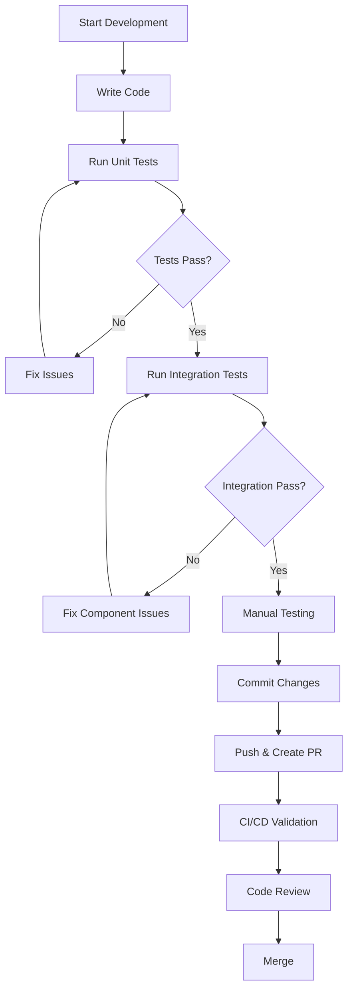

# Developer Testing Workflow Guide

## Overview

This guide outlines the testing workflow for daily development on the RrishMusic project. It covers how to integrate testing into your development process, from writing new features to preparing pull requests.

## Development Workflow Integration

### Daily Development Cycle



## Feature Development Testing Strategy

### 1. Test-Driven Development (TDD) Approach

**For new features, follow this order:**

```bash
# 1. Write failing unit tests first
touch src/components/NewFeature/__tests__/NewFeature.test.tsx

# 2. Write minimal implementation
touch src/components/NewFeature/NewFeature.tsx

# 3. Run tests and iterate
npm test -- src/components/NewFeature
```

### 2. Content System Features

**When working with content system:**

```bash
# 1. Add content validation tests
npm test -- src/content/__tests__/validation.test.ts

# 2. Test content type changes
npm test -- src/content/__tests__/types.test.ts

# 3. Validate hook integration
npm test -- src/content/__tests__/hooks.test.tsx
```

### 3. UI Component Development

**Component development workflow:**

```bash
# 1. Start development server
npm run dev

# 2. Start test watcher (separate terminal)
npm test

# 3. Create component test file
# src/components/YourComponent/__tests__/YourComponent.test.tsx

# 4. Write tests for:
# - Component rendering
# - Props handling
# - User interactions
# - Content integration
# - Responsive behavior
```

## Pre-Commit Testing Checklist

### Essential Tests Before Committing

```bash
# 1. Run all unit and integration tests
npm test -- --run

# 2. Check TypeScript compilation
npm run type-check

# 3. Lint code
npm run lint

# 4. Build project
npm run build

# 5. Run quick E2E smoke tests
npx playwright test tests/e2e/smoke.spec.ts
```

### Automated Pre-Commit Script

Create a pre-commit script in `package.json`:

```json
{
  "scripts": {
    "pre-commit": "npm run type-check && npm run lint && npm test -- --run && npm run build"
  }
}
```

## Component Testing Patterns

### Testing Component Rendering

```typescript
// src/components/sections/__tests__/YourComponent.test.tsx
import { render, screen } from '@testing-library/react'
import { describe, test, expect } from 'vitest'
import YourComponent from '../YourComponent'

describe('YourComponent', () => {
  test('renders component content correctly', () => {
    render(<YourComponent />)
    
    expect(screen.getByRole('heading')).toBeInTheDocument()
    expect(screen.getByText(/expected content/i)).toBeInTheDocument()
  })

  test('handles content integration', () => {
    render(<YourComponent />)
    
    // Test content from JSON files
    expect(screen.getByText(/content from json/i)).toBeInTheDocument()
  })
})
```

### Testing User Interactions

```typescript
import { render, screen } from '@testing-library/react'
import userEvent from '@testing-library/user-event'
import { describe, test, expect } from 'vitest'

describe('Interactive Component', () => {
  test('handles user interactions', async () => {
    const user = userEvent.setup()
    render(<InteractiveComponent />)
    
    const button = screen.getByRole('button', { name: /click me/i })
    await user.click(button)
    
    expect(screen.getByText(/clicked state/i)).toBeInTheDocument()
  })
})
```

### Testing Responsive Behavior

```typescript
import { render, screen } from '@testing-library/react'
import { describe, test, expect, beforeEach } from 'vitest'

describe('Responsive Component', () => {
  beforeEach(() => {
    // Mock window.matchMedia for responsive tests
    Object.defineProperty(window, 'matchMedia', {
      writable: true,
      value: (query: string) => ({
        matches: query.includes('768px'),
        addEventListener: () => {},
        removeEventListener: () => {},
      }),
    })
  })

  test('adapts to mobile viewport', () => {
    render(<ResponsiveComponent />)
    
    expect(screen.getByTestId('mobile-layout')).toBeInTheDocument()
  })
})
```

## Integration Testing Workflow

### Testing Component + Content Integration

```typescript
import { render, screen } from '@testing-library/react'
import { describe, test, expect } from 'vitest'
import { useContent } from '../../../content/hooks/useContent'
import ComponentWithContent from '../ComponentWithContent'

// Mock the content hook if needed
vi.mock('../../../content/hooks/useContent')

describe('Component Content Integration', () => {
  test('integrates with content system', () => {
    // Mock content data
    vi.mocked(useContent).mockReturnValue({
      hero: { title: 'Test Title', subtitle: 'Test Subtitle' },
      loading: false,
      error: null
    })

    render(<ComponentWithContent />)
    
    expect(screen.getByText('Test Title')).toBeInTheDocument()
    expect(screen.getByText('Test Subtitle')).toBeInTheDocument()
  })
})
```

## E2E Testing During Development

### Running E2E Tests Locally

```bash
# Quick smoke tests during development
npx playwright test tests/e2e/smoke.spec.ts

# Test specific functionality you're working on
npx playwright test tests/e2e/homepage.spec.ts --grep "hero section"

# Test with visible browser for debugging
npx playwright test --headed tests/e2e/homepage.spec.ts

# Test mobile experience
npx playwright test tests/e2e/mobile.spec.ts --project="Mobile Chrome"
```

### E2E Development Workflow

```bash
# 1. Start development server
npm run dev

# 2. Run E2E tests against local server
BASE_URL=http://localhost:5173 npm run test:e2e

# 3. Debug failing tests
npx playwright test --debug tests/e2e/failing-test.spec.ts

# 4. Update page objects if UI changes
# Edit tests/e2e/page-objects/HomePage.ts
```

## Performance Testing During Development

### Local Performance Monitoring

```bash
# Run performance tests on your changes
npm run test:performance

# Test specific performance aspects
npm run test:performance:hooks
npm run test:performance:components

# Monitor bundle size changes  
npm run test:performance:bundle

# Run performance benchmark
node scripts/performance-benchmark.js
```

### Performance Development Checklist

- [ ] Bundle size hasn't increased significantly
- [ ] Component rendering time <100ms
- [ ] Content hook performance <50ms
- [ ] Memory usage stays within limits
- [ ] Core Web Vitals maintained

## Debugging Test Failures

### Unit Test Debugging

```bash
# Run single test with detailed output
npm test -- --reporter=verbose src/path/to/failing.test.ts

# Debug specific test case
npm test -- --grep "failing test name"

# Clear test cache if needed
npm test -- --clearCache

# Run with coverage to identify untested code paths
npm run test:coverage
```

### E2E Test Debugging

```bash
# Debug mode (step through tests)
npx playwright test --debug failing-test.spec.ts

# Run with visible browser
npx playwright test --headed failing-test.spec.ts

# Take screenshots during test
# (Add await page.screenshot({ path: 'debug.png' }) in test)

# View test report with videos/screenshots
npm run test:e2e:report
```

### Common Debugging Techniques

**Test isolation issues:**
```typescript
// Ensure proper cleanup between tests
afterEach(() => {
  vi.clearAllMocks()
  // Clean up any global state
})
```

**Async/await issues:**
```typescript
// Always await async operations
test('async test', async () => {
  await user.click(button)
  await waitFor(() => {
    expect(screen.getByText('result')).toBeInTheDocument()
  })
})
```

**Timing issues in E2E:**
```typescript
// Use proper wait conditions
await page.waitForLoadState('networkidle')
await expect(page.locator('selector')).toBeVisible()
```

## Writing New Tests

### Unit Test Template

```typescript
// src/components/NewFeature/__tests__/NewFeature.test.tsx
import { render, screen } from '@testing-library/react'
import userEvent from '@testing-library/user-event'
import { describe, test, expect, beforeEach, vi } from 'vitest'
import NewFeature from '../NewFeature'

describe('NewFeature', () => {
  beforeEach(() => {
    // Setup before each test
    vi.clearAllMocks()
  })

  describe('Rendering', () => {
    test('renders component correctly', () => {
      render(<NewFeature />)
      
      expect(screen.getByRole('main')).toBeInTheDocument()
    })

    test('displays correct content', () => {
      render(<NewFeature prop="test" />)
      
      expect(screen.getByText('test')).toBeInTheDocument()
    })
  })

  describe('Interactions', () => {
    test('handles user interaction', async () => {
      const user = userEvent.setup()
      render(<NewFeature />)
      
      await user.click(screen.getByRole('button'))
      
      expect(screen.getByText('clicked')).toBeInTheDocument()
    })
  })

  describe('Content Integration', () => {
    test('integrates with content system', () => {
      render(<NewFeature />)
      
      // Test content system integration
      expect(screen.getByText(/content from system/i)).toBeInTheDocument()
    })
  })
})
```

### E2E Test Template

```typescript
// tests/e2e/new-feature.spec.ts
import { test, expect } from './setup'
import { HomePage } from './page-objects/HomePage'

test.describe('New Feature', () => {
  let homePage: HomePage

  test.beforeEach(async ({ page }) => {
    homePage = new HomePage(page)
    await homePage.goto()
  })

  test('should display new feature correctly', async () => {
    await expect(page.locator('[data-testid="new-feature"]')).toBeVisible()
  })

  test('should handle user interaction', async () => {
    await page.click('[data-testid="new-feature-button"]')
    await expect(page.locator('[data-testid="result"]')).toBeVisible()
  })

  test('should work on mobile', async ({ isMobile }) => {
    test.skip(!isMobile, 'Mobile-specific test')
    
    await expect(page.locator('[data-testid="mobile-feature"]')).toBeVisible()
  })
})
```

## Pull Request Testing Workflow

### Before Creating PR

```bash
# 1. Ensure all tests pass locally
npm run test:all

# 2. Check performance impact
npm run test:performance

# 3. Validate build
npm run build

# 4. Run E2E tests against build
npm run preview & 
BASE_URL=http://localhost:4173 npm run test:e2e
```

### PR Testing Requirements

All PRs must pass:

- **Unit Tests**: All existing + new tests pass
- **Integration Tests**: Component integration verified
- **E2E Tests**: User workflows still work
- **Performance Tests**: No performance regression
- **Build Tests**: Application builds successfully
- **Type Checking**: No TypeScript errors
- **Linting**: Code style compliance

### PR Testing Checklist Template

```markdown
## Testing Checklist

### Unit Tests
- [ ] All unit tests pass
- [ ] New functionality has unit tests
- [ ] Test coverage maintained (>80%)

### Integration Tests  
- [ ] Component integration tests pass
- [ ] Content system integration verified
- [ ] User interaction tests updated

### E2E Tests
- [ ] All E2E tests pass
- [ ] New user workflows tested
- [ ] Cross-browser compatibility verified

### Performance Tests
- [ ] No performance regression
- [ ] Bundle size within budget
- [ ] Core Web Vitals maintained

### Manual Testing
- [ ] Feature works in development
- [ ] Responsive design verified
- [ ] Accessibility tested
```

## Continuous Integration Workflow

### Understanding CI Test Results

**GitHub Actions Test Workflow:**

```yaml
1. Setup (Node.js, dependencies)
2. Type checking → TypeScript compilation
3. Linting → Code style validation  
4. Unit Tests → Business logic validation
5. Build → Application compilation
6. E2E Tests → User workflow validation
7. Performance Tests → Performance monitoring
8. Artifacts → Test reports and coverage
```

### Reading CI Test Outputs

**Successful CI Run:**
```
✓ Type checking passed
✓ Linting passed  
✓ Unit tests: 189/189 passed
✓ Build completed successfully
✓ E2E tests: 24/24 passed (Chromium, Firefox, WebKit)
✓ Performance tests: All budgets met
```

**Failed CI Run Investigation:**
```bash
# 1. Check the specific failing step
# 2. Reproduce locally:
npm run type-check  # If TypeScript failed
npm run lint        # If linting failed
npm test           # If unit tests failed
npm run build      # If build failed
npm run test:e2e   # If E2E tests failed
```

## Team Collaboration

### Test Result Sharing

**When sharing test failures:**
1. Include specific error messages
2. Share reproduction steps
3. Provide environment details
4. Include relevant screenshots/videos

**When reviewing PRs:**
1. Verify test coverage of new code
2. Check test quality and maintainability
3. Ensure integration tests cover new workflows
4. Validate performance impact

### Test Maintenance Responsibilities

**Individual Developer:**
- Write tests for new features
- Update tests when changing functionality
- Fix failing tests in your PRs
- Monitor test performance

**Team Responsibilities:**
- Review test quality in PRs
- Maintain shared test utilities
- Update test documentation
- Monitor overall test health

## Advanced Testing Workflows

### Testing Content Changes

```bash
# When updating content JSON files:
npm test -- src/content/__tests__/validation.test.ts
npm test -- src/components/sections/__tests__/

# Verify content integration:
npm run test:e2e
```

### Testing Performance Optimizations

```bash
# Before optimization:
npm run test:performance:bundle
npm run test:performance:vitals

# After optimization:
npm run test:performance:bundle
# Verify improvements in results
```

### Testing Accessibility Improvements

```bash
# Run accessibility-focused E2E tests:
npx playwright test --grep "accessibility"
npx playwright test tests/e2e/navigation.spec.ts
```

---

## Quick Reference

### Essential Commands
```bash
# Daily development
npm test                    # Unit tests in watch mode
npm run test:coverage      # Coverage report
npm run test:e2e          # Full E2E test suite

# Pre-commit validation  
npm run test:all          # All tests
npm run build            # Build validation

# Debugging
npm run test:e2e:debug   # Debug E2E tests
npm run test:e2e:ui      # Interactive E2E testing
npm run test:performance # Performance monitoring
```

### Testing Priorities by Feature Type

**New Components:**
1. Unit tests (rendering, props, interactions)
2. Integration tests (content system)
3. E2E tests (user workflows)

**Content Updates:**
1. Content validation tests
2. Integration tests (component rendering)  
3. E2E tests (content display)

**Performance Optimizations:**
1. Performance tests (before/after)
2. Bundle analysis
3. E2E tests (regression prevention)

**Accessibility Improvements:**
1. Unit tests (ARIA attributes)
2. Integration tests (keyboard navigation)
3. E2E tests (screen reader compatibility)

---

This workflow ensures high code quality while maintaining development velocity. Always prioritize test quality over quantity, and remember that tests serve as documentation for future developers.

**Happy Testing!** 🧪⚡