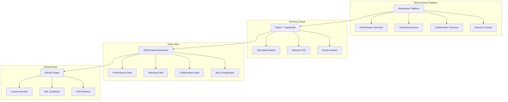
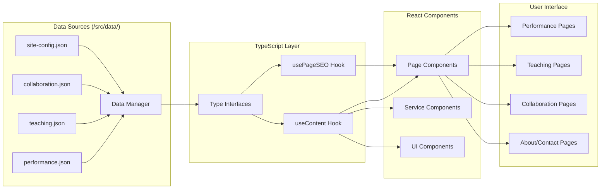
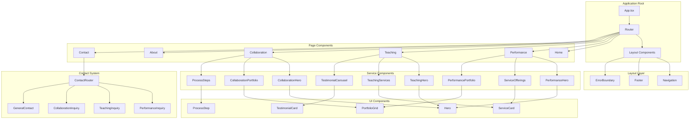
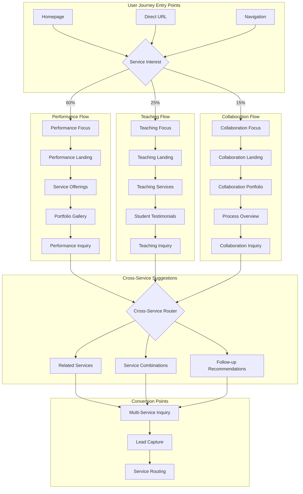
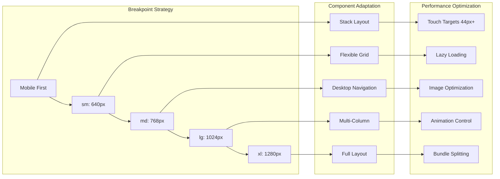
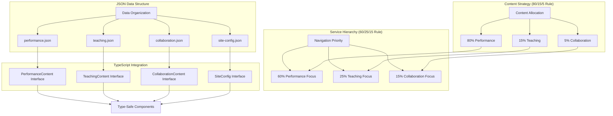
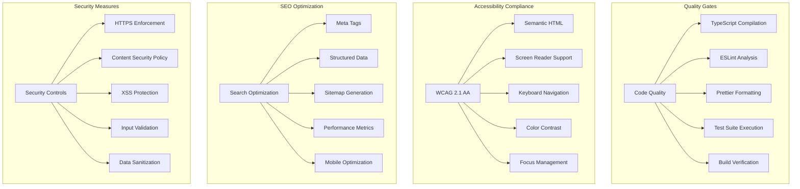
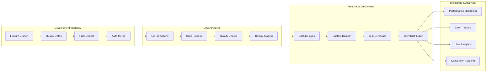
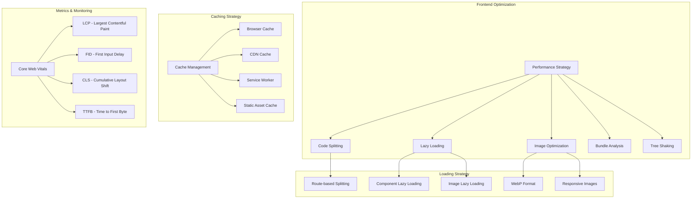

# RrishMusic Platform Architecture

This document provides comprehensive visual architecture documentation for the RrishMusic multi-service platform.

## 🏗️ System Architecture Overview

## 📊 Data Flow Architecture

## 🧩 Component Hierarchy

## 🔄 Service Integration Flow

## 📱 Mobile-First Responsive Architecture

## 🎯 Content Management Architecture

## 🔐 Quality & Security Architecture

## 🚀 Deployment Architecture

## 📊 Performance Optimization Architecture

---

## 🏆 Architecture Achievements

### ✅ Multi-Service Platform Success
- **Complete service separation** with clear boundaries
- **Unified user experience** across all service areas
- **Strategic content hierarchy** (60/25/15 service focus)
- **Context-aware contact routing** system

### ✅ Technical Excellence
- **Type-safe architecture** with comprehensive TypeScript coverage
- **Mobile-first responsive design** with systematic breakpoints
- **Performance-optimized** with lazy loading and code splitting
- **Accessibility compliant** meeting WCAG 2.1 AA standards

### ✅ Data Management Innovation
- **Centralized JSON architecture** for easy content management
- **Developer-friendly** content updates without code changes
- **Service-specific data separation** with TypeScript interfaces
- **Scalable structure** for future service additions

### ✅ Quality Assurance Framework
- **Comprehensive quality gates** before every deployment
- **Test-driven development** with regression analysis
- **Automated CI/CD pipeline** with GitHub Actions
- **Continuous monitoring** and performance optimization

---

**Architecture Documentation Complete**: August 2025  
**Platform Status**: 🎊 **COMPLETE 3-MILESTONE TRANSFORMATION + DOCUMENTATION**  
**Final Achievement**: 100% Multi-Service Platform with Comprehensive Documentation