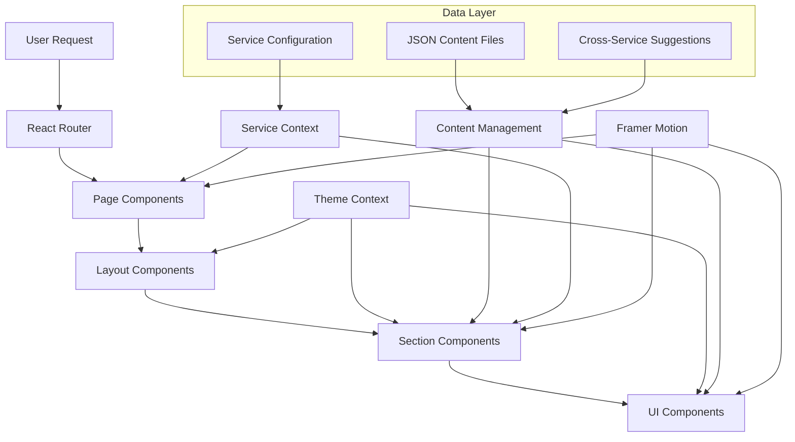
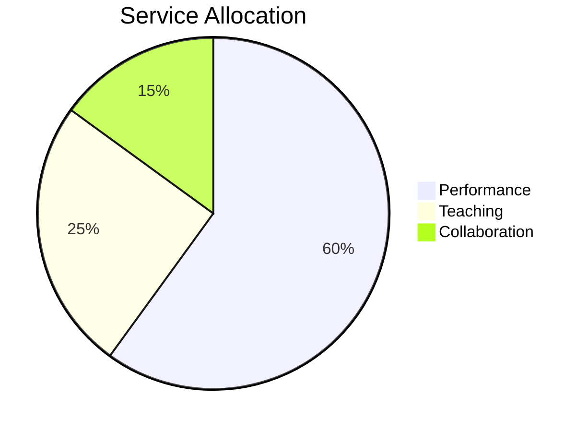
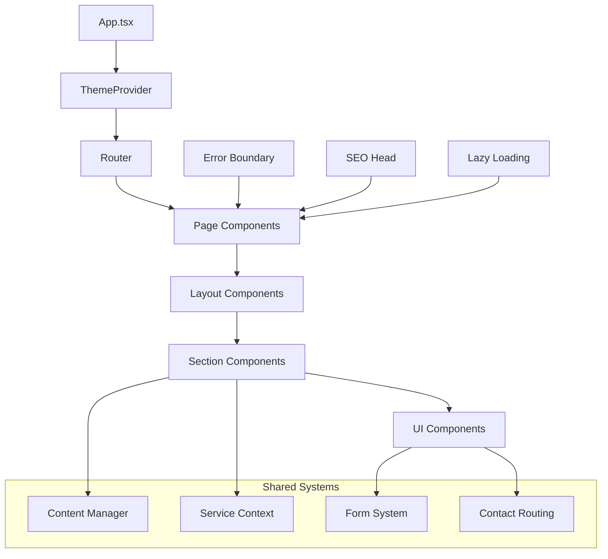

# RrishMusic Architecture Documentation

## System Overview

RrishMusic is a modern multi-service musician platform built with React, TypeScript, and Vite. The platform serves three primary services: Performance, Teaching, and Collaboration, with a sophisticated content allocation system and theme-aware design.



## High-Level Architecture

### 1. **Frontend Architecture**
- **Framework**: React 19.1.1 with TypeScript
- **Build Tool**: Vite 7.1.2 with hot module replacement
- **Styling**: Tailwind CSS 3.4.17 with custom theme system
- **Animation**: Framer Motion 12.23.12 for smooth transitions
- **Routing**: React Router DOM 7.8.2 with lazy loading

### 2. **Multi-Service Platform Design**

The platform follows a **60/25/15 service allocation hierarchy**:



- **Performance Services (60%)**: Primary focus with premium content allocation
- **Teaching Services (25%)**: Secondary focus with established conversion paths
- **Collaboration Services (15%)**: Tertiary focus with growth potential

### 3. **Component Architecture Pattern**



## Technology Stack

### **Core Technologies**
- **React 19.1.1**: Component library with latest features
- **TypeScript ~5.8.3**: Type safety and developer experience
- **Vite 7.1.2**: Build tool and development server
- **Tailwind CSS 3.4.17**: Utility-first CSS framework

### **Animation & Interaction**
- **Framer Motion 12.23.12**: Declarative animations and gestures
- **Custom scroll spy system**: Section-based navigation
- **Smooth scroll utilities**: Enhanced user experience

### **Development Tools**
- **ESLint & Prettier**: Code quality and formatting
- **TypeScript ESLint**: Advanced TypeScript linting
- **Autoprefixer**: CSS vendor prefixes
- **PostCSS**: CSS processing pipeline

### **Testing & Quality**
- **Vitest**: Unit and integration testing
- **Coverage reporting**: Code coverage analysis
- **Quality gates**: Pre-commit validation

## Folder Structure

```
src/
├── components/           # React components organized by type
│   ├── common/          # Shared components (ErrorBoundary, SEOHead)
│   ├── collaboration/   # Collaboration service components
│   ├── forms/          # Form system with service-specific forms
│   ├── layout/         # Layout components (Navigation, etc.)
│   ├── optimization/   # Performance optimization components
│   ├── pages/          # Page-level components
│   ├── sections/       # Page section components
│   ├── social/         # Social media integration
│   └── ui/             # Reusable UI components
├── content/            # JSON data files for content management
│   ├── ui/             # UI-specific configuration
│   └── *.json          # Service and feature content
├── contexts/           # React contexts (ThemeContext)
├── hooks/              # Custom React hooks
├── types/              # TypeScript type definitions
├── utils/              # Utility functions and helpers
└── assets/            # Static assets
```

## Key Architectural Decisions

### 1. **Content-First Architecture**
- JSON-based content management for easy updates
- Service configuration drives UI behavior
- Cross-service suggestion system

### 2. **Theme System Architecture**
- CSS custom properties for runtime theme switching
- System preference detection with manual override
- Motion preference support for accessibility

### 3. **Performance Optimization**
- Lazy loading for all major components
- Code splitting with Vite's rollup configuration
- Optimized bundle for GitHub Pages deployment

### 4. **Type Safety**
- Comprehensive TypeScript coverage
- Strict type checking enabled
- Custom types for business logic

### 5. **Mobile-First Responsive Design**
- Tailwind's responsive utilities
- Custom breakpoints for optimal viewing
- Touch-optimized interactions

## Related Documentation

- [Component Hierarchy](./component-hierarchy.md) - Detailed component structure
- [Theme System](./theme-system.md) - Theme implementation details  
- [Deployment](./deployment.md) - Build and deployment architecture

## Development Workflow

The project follows a **milestone-based development approach** with 4 phases:

1. **Phase 1: Foundation Enhancement** - Navigation and core pages
2. **Phase 2: Service Integration** - Multi-service functionality
3. **Phase 3: Content Optimization** - Content hierarchy and presentation
4. **Phase 4: Experience Refinement** - Advanced features and optimization

Each phase is managed through GitHub milestones with systematic issue tracking and quality gates.

## Quality Assurance

### **Pre-commit Quality Gates**
```bash
npm run lint          # Prettier formatting
npx tsc --noEmit      # TypeScript checking
npm run build         # Build verification
```

### **Testing Strategy**
- Unit tests for critical utilities
- Component tests for UI elements
- Integration tests for form workflows
- Visual regression prevention

### **Performance Monitoring**
- Bundle size optimization
- Core Web Vitals tracking
- Accessibility compliance (WCAG)

---

**Last Updated**: August 2025  
**Version**: Multi-Service Platform v1.0  
**Maintainer**: Development Team