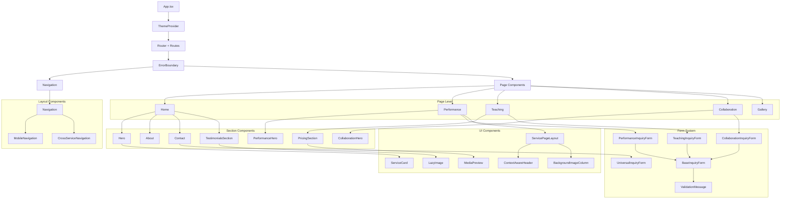
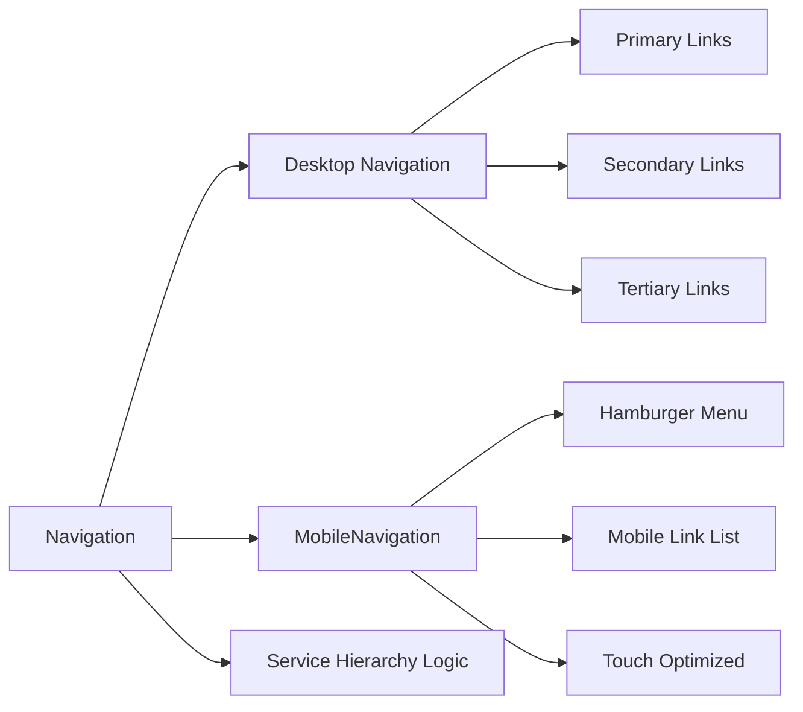
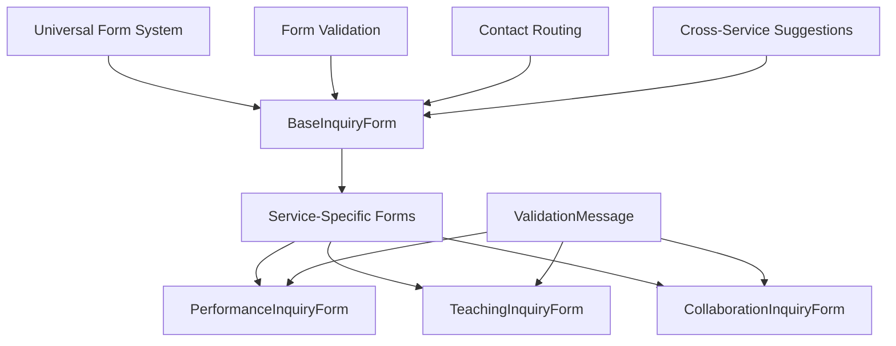

# Component Hierarchy Documentation

## Component Architecture Overview

The RrishMusic application follows a hierarchical component architecture with clear separation of concerns and reusable patterns.



## Component Categories

### 1. **Core Application Components**

#### **App.tsx** - Application Root
- Manages global routing and lazy loading
- Integrates theme provider and error boundaries
- Handles page transitions with Framer Motion

```typescript
// Key responsibilities:
- Route management
- Lazy component loading
- Global state providers
- Page transition animations
```

#### **ErrorBoundary** - Error Management
- Catches JavaScript errors in component tree
- Provides graceful fallback UI
- Maintains user experience during failures

### 2. **Layout Components**

#### **Navigation.tsx** - Primary Navigation


**Features:**
- Service-based visual hierarchy (Primary/Secondary/Tertiary)
- Scroll spy integration for section highlighting
- Mobile-responsive with hamburger menu
- Smooth scroll navigation

#### **CrossServiceNavigation** - Service Integration
- Provides contextual navigation between services
- Maintains user journey continuity
- Implements cross-service suggestions

### 3. **Page Components**

#### **Service Page Pattern**
All service pages follow a consistent pattern:

```typescript
interface ServicePageStructure {
  hero: HeroComponent
  sections: SectionComponent[]
  forms: FormComponent[]
  cta: CTAComponent
}
```

#### **Home.tsx** - Homepage
- Multi-service hero with 60/25/15 allocation
- Service overview cards
- Primary conversion paths
- Social proof integration

#### **Performance.tsx** - Performance Services
- Performance-specific hero
- Portfolio gallery
- Performance inquiry form
- Testimonials and credentials

#### **Teaching.tsx** - Teaching Services  
- Teaching approach explanation
- Lesson pricing and packages
- Teaching inquiry form
- Student testimonials

#### **Collaboration.tsx** - Collaboration Services
- Collaboration process overview
- Portfolio showcase
- Collaboration inquiry form
- Success stories

### 4. **Section Components**

#### **Hero Components**
- **Hero.tsx**: Multi-service homepage hero
- **PerformanceHero.tsx**: Performance-specific hero
- **CollaborationHero.tsx**: Collaboration-specific hero

Each hero component includes:
- Service-specific messaging
- Primary call-to-action
- Visual hierarchy implementation
- Mobile-optimized design

#### **Content Sections**
- **About.tsx**: Musician credentials and background
- **TestimonialsSection.tsx**: Social proof display
- **PricingSection.tsx**: Service pricing tables
- **Contact.tsx**: Contact form integration

### 5. **Form System Architecture**



#### **Form Component Hierarchy**

**BaseInquiryForm.tsx** - Core Form Logic
- Field validation
- Submission handling
- Error management
- Accessibility features

**Service-Specific Forms**
- **PerformanceInquiryForm**: Performance booking inquiries
- **TeachingInquiryForm**: Lesson inquiries with scheduling
- **CollaborationInquiryForm**: Collaboration project inquiries

**Form Configuration System**
- `formConfigurations.ts`: Centralized form field definitions
- Type-safe form validation
- Reusable validation messages

### 6. **UI Component Library**

#### **Specialized Components**

**ServiceCard.tsx** - Service Display Cards
```typescript
interface ServiceCardProps {
  title: string
  description: string
  features: string[]
  priority: 'primary' | 'secondary' | 'tertiary'
  ctaText: string
  ctaLink: string
}
```

**LazyImage.tsx** - Optimized Image Loading
- Intersection Observer for lazy loading
- Placeholder handling
- Error state management
- Performance optimization

**MediaPreview.tsx** - Audio/Video Previews
- Portfolio media display
- Lazy loading integration
- Responsive design
- Touch-optimized controls

**ServicePageLayout.tsx** - Service Page Template
- Consistent service page structure
- Header/content/footer layout
- Mobile-responsive design
- SEO optimization integration

### 7. **Optimization Components**

#### **JourneyOptimization.tsx**
- Cross-service user journey tracking
- Conversion path optimization
- Service suggestion logic

#### **CrossServiceSuggestionsManager.tsx**
- Manages cross-service recommendations
- Context-aware suggestions
- Conversion optimization

## Component Communication Patterns

### 1. **Props-Based Communication**
- Parent-to-child data flow
- Type-safe prop interfaces
- Default prop handling

### 2. **Context-Based State**
- Theme context for global theming
- Service context for multi-service logic
- Content context for data management

### 3. **Custom Hooks Integration**
- `useContent`: Content management
- `usePageSEO`: SEO optimization
- `useScrollSpy`: Navigation highlighting
- `useDeviceDetection`: Responsive behavior

## Mobile-First Design Principles

### **Responsive Component Design**
```typescript
// Example responsive component pattern
const ResponsiveComponent = () => {
  const { isMobile, isTablet } = useDeviceDetection()
  
  return (
    <div className={`
      ${isMobile ? 'flex-col space-y-4' : 'flex-row space-x-6'}
      ${isTablet ? 'grid grid-cols-2' : ''}
    `}>
      {/* Component content */}
    </div>
  )
}
```

### **Touch Optimization**
- Minimum 44px touch targets
- Swipe gesture support
- Mobile-optimized forms
- Responsive image handling

## Performance Optimization

### **Lazy Loading Strategy**
```typescript
// Page-level lazy loading
const Performance = lazy(() => import('./components/pages/Performance'))

// Section-level lazy loading with error boundaries
const LazySection = ({ children }) => (
  <Suspense fallback={<Spinner />}>
    <ErrorBoundary>
      {children}
    </ErrorBoundary>
  </Suspense>
)
```

### **Code Splitting**
- Route-based splitting
- Component-level splitting for heavy components
- Dynamic imports for optional features

### **Memo Optimization**
```typescript
// Expensive component memoization
const OptimizedComponent = React.memo(({ data }) => {
  return <ExpensiveRender data={data} />
}, (prevProps, nextProps) => {
  return prevProps.data.id === nextProps.data.id
})
```

## Testing Strategy

### **Component Testing Patterns**
```typescript
// Example component test structure
describe('ServiceCard', () => {
  it('renders with correct priority styling', () => {
    render(<ServiceCard priority="primary" {...props} />)
    expect(screen.getByRole('article')).toHaveClass('primary-styles')
  })
  
  it('handles click interactions', () => {
    const onClickMock = jest.fn()
    render(<ServiceCard onClick={onClickMock} {...props} />)
    fireEvent.click(screen.getByRole('button'))
    expect(onClickMock).toHaveBeenCalledTimes(1)
  })
})
```

---

**Last Updated**: August 2025  
**Related**: [Theme System](./theme-system.md) | [Deployment](./deployment.md)