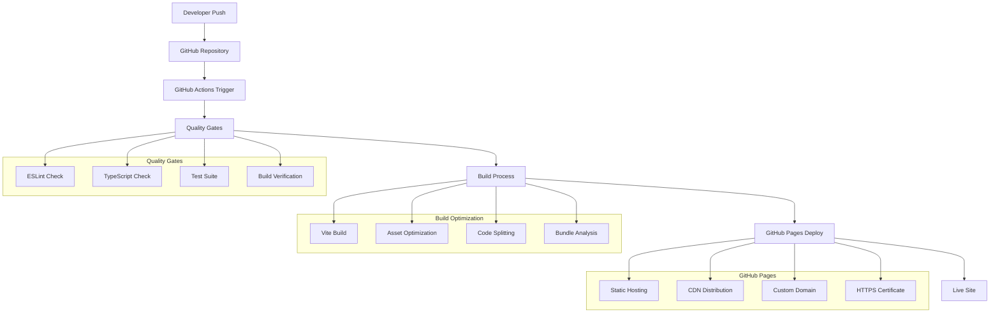
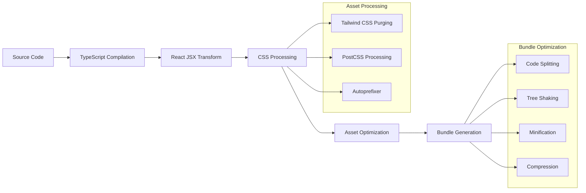

# Deployment Architecture

## Overview

The RrishMusic platform is deployed using GitHub Pages with a modern CI/CD pipeline powered by GitHub Actions. The deployment architecture emphasizes performance, reliability, and automated quality assurance.



## Build Architecture

### 1. **Vite Build Configuration**

The build process is optimized for production deployment with specific GitHub Pages considerations:

```typescript
// vite.config.ts - Build configuration
export default defineConfig({
  base: '/',
  build: {
    outDir: 'dist',
    assetsDir: 'assets',
    sourcemap: false,
    
    // GitHub Pages SPA optimization
    rollupOptions: {
      output: {
        manualChunks: undefined, // Prevent chunk splitting issues
      },
    },
  },
  
  // Production server configuration
  preview: {
    port: 4173,
    host: true,
    strictPort: true,
  }
})
```

### 2. **Build Optimization Pipeline**



### 3. **Asset Optimization Strategy**

#### **Image Optimization**
```typescript
// LazyImage component with optimization
const LazyImage = ({ src, alt, className }) => {
  return (
    
  )
}
```

#### **Code Splitting Strategy**
```typescript
// Lazy loading for optimal bundle size
const Home = lazy(() => 
  import('./components/pages/Home').then(module => ({ 
    default: module.Home 
  }))
)

const Performance = lazy(() => import('./components/pages/Performance'))
const Teaching = lazy(() => import('./components/pages/Teaching'))
const Collaboration = lazy(() => import('./components/pages/Collaboration'))
```

## CI/CD Pipeline

### 1. **Quality Gates Workflow**

```yaml
# .github/workflows/quality-gates.yml (concept)
name: Quality Gates
on:
  push:
    branches: [ main, feature/* ]
  pull_request:
    branches: [ main ]

jobs:
  quality-check:
    runs-on: ubuntu-latest
    steps:
      - uses: actions/checkout@v4
      
      - name: Setup Node.js
        uses: actions/setup-node@v4
        with:
          node-version: '20'
          cache: 'npm'
      
      - name: Install dependencies
        run: npm ci
      
      - name: ESLint Check
        run: npx eslint src --ext .ts,.tsx
      
      - name: TypeScript Check
        run: npx tsc --noEmit
      
      - name: Test Suite
        run: npm run test
      
      - name: Build Verification
        run: npm run build
```

### 2. **Deployment Workflow**

```yaml
# .github/workflows/deploy.yml (concept)
name: Deploy to GitHub Pages
on:
  push:
    branches: [ main ]

jobs:
  deploy:
    runs-on: ubuntu-latest
    permissions:
      contents: read
      pages: write
      id-token: write
    
    steps:
      - name: Checkout
        uses: actions/checkout@v4
      
      - name: Setup Node.js
        uses: actions/setup-node@v4
        with:
          node-version: '20'
          cache: 'npm'
      
      - name: Install dependencies
        run: npm ci
      
      - name: Build application
        run: npm run build
      
      - name: Setup Pages
        uses: actions/configure-pages@v4
      
      - name: Upload artifact
        uses: actions/upload-pages-artifact@v3
        with:
          path: './dist'
      
      - name: Deploy to GitHub Pages
        id: deployment
        uses: actions/deploy-pages@v4
```

## Production Configuration

### 1. **Performance Optimization**

#### **Bundle Size Management**
```typescript
// Bundle analysis configuration
import { defineConfig } from 'vite'
import { visualizer } from 'rollup-plugin-visualizer'

export default defineConfig({
  plugins: [
    // Bundle size analysis
    process.env.ANALYZE && visualizer({
      filename: 'dist/bundle-analysis.html',
      open: true,
      gzipSize: true,
      brotliSize: true
    })
  ]
})
```

#### **Caching Strategy**
```typescript
// Service worker registration (conceptual)
const registerServiceWorker = () => {
  if ('serviceWorker' in navigator && process.env.NODE_ENV === 'production') {
    window.addEventListener('load', () => {
      navigator.serviceWorker.register('/sw.js')
        .then(registration => {
          console.log('SW registered: ', registration)
        })
        .catch(registrationError => {
          console.log('SW registration failed: ', registrationError)
        })
    })
  }
}
```

### 2. **SEO and Meta Tag Management**

```typescript
// SEO optimization in production
const SEOHead = ({ title, description, image, url }) => {
  return (
    <Helmet>
      <title>{title} | RrishMusic</title>
      <meta name="description" content={description} />
      
      {/* Open Graph */}
      <meta property="og:title" content={title} />
      <meta property="og:description" content={description} />
      <meta property="og:image" content={image} />
      <meta property="og:url" content={url} />
      <meta property="og:type" content="website" />
      
      {/* Twitter Card */}
      <meta name="twitter:card" content="summary_large_image" />
      <meta name="twitter:title" content={title} />
      <meta name="twitter:description" content={description} />
      <meta name="twitter:image" content={image} />
      
      {/* Canonical URL */}
      <link rel="canonical" href={url} />
    </Helmet>
  )
}
```

## GitHub Pages Configuration

### 1. **Static Site Configuration**

#### **Custom Domain Setup**
```
# CNAME file
www.rrishmusic.com
```

#### **404 Handling for SPA**
```html
<!-- 404.html for client-side routing -->
<!DOCTYPE html>
<html>
<head>
  <meta charset="utf-8">
  <title>RrishMusic</title>
  <script type="text/javascript">
    // Redirect to index.html with path in query string
    var pathSegmentsToKeep = 0;
    var l = window.location;
    l.replace(
      l.protocol + '//' + l.hostname + (l.port ? ':' + l.port : '') +
      l.pathname.split('/').slice(0, 1 + pathSegmentsToKeep).join('/') + 
      '/?/' +
      l.pathname.slice(1).split('/').slice(pathSegmentsToKeep).join('/').replace(/&/g, '~and~') +
      (l.search ? '&' + l.search.slice(1).replace(/&/g, '~and~') : '') +
      l.hash
    );
  </script>
</head>
<body></body>
</html>
```

### 2. **Performance Monitoring**

#### **Core Web Vitals Optimization**
```typescript
// Performance monitoring
const measurePerformance = () => {
  if ('performance' in window && 'PerformanceObserver' in window) {
    // Largest Contentful Paint
    new PerformanceObserver((list) => {
      list.getEntries().forEach((entry) => {
        console.log('LCP:', entry.startTime)
      })
    }).observe({ entryTypes: ['largest-contentful-paint'] })
    
    // Cumulative Layout Shift
    new PerformanceObserver((list) => {
      list.getEntries().forEach((entry) => {
        if (!entry.hadRecentInput) {
          console.log('CLS:', entry.value)
        }
      })
    }).observe({ entryTypes: ['layout-shift'] })
  }
}
```

## Environment Management

### 1. **Environment Variables**

```typescript
// Environment configuration
interface Config {
  readonly apiUrl: string
  readonly environment: 'development' | 'production'
  readonly analyticsId: string
  readonly sentryDsn: string
}

const config: Config = {
  apiUrl: import.meta.env.VITE_API_URL || 'https://api.rrishmusic.com',
  environment: import.meta.env.MODE as 'development' | 'production',
  analyticsId: import.meta.env.VITE_ANALYTICS_ID || '',
  sentryDsn: import.meta.env.VITE_SENTRY_DSN || '',
}

export default config
```

### 2. **Feature Flags**

```typescript
// Feature flag system
const featureFlags = {
  enableAnalytics: process.env.NODE_ENV === 'production',
  enableServiceWorker: process.env.NODE_ENV === 'production',
  enableErrorReporting: process.env.NODE_ENV === 'production',
  debugMode: process.env.NODE_ENV === 'development',
}

export const useFeatureFlag = (flag: keyof typeof featureFlags) => {
  return featureFlags[flag]
}
```

## Deployment Monitoring

### 1. **Health Checks**

```typescript
// Application health check
const healthCheck = {
  timestamp: new Date().toISOString(),
  version: process.env.REACT_APP_VERSION || '1.0.0',
  environment: process.env.NODE_ENV,
  services: {
    frontend: 'healthy',
    routing: 'healthy',
    themes: 'healthy',
  }
}

// Expose health endpoint
export const getHealthStatus = () => healthCheck
```

### 2. **Error Monitoring**

```typescript
// Error boundary with reporting
class ProductionErrorBoundary extends React.Component {
  componentDidCatch(error: Error, errorInfo: ErrorInfo) {
    if (process.env.NODE_ENV === 'production') {
      // Report to monitoring service
      console.error('Application Error:', {
        error: error.message,
        stack: error.stack,
        componentStack: errorInfo.componentStack,
        timestamp: new Date().toISOString(),
      })
    }
  }
  
  render() {
    if (this.state.hasError) {
      return (
        <div className="min-h-screen flex items-center justify-center bg-theme-bg">
          <div className="text-center">
            <h2 className="text-2xl font-bold text-theme-text mb-4">
              Something went wrong
            </h2>
            <button 
              onClick={() => window.location.reload()}
              className="bg-theme-primary text-white px-6 py-3 rounded-lg"
            >
              Refresh Page
            </button>
          </div>
        </div>
      )
    }
    
    return this.props.children
  }
}
```

## Security Considerations

### 1. **Content Security Policy**

```html
<!-- CSP headers for security -->
<meta http-equiv="Content-Security-Policy" content="
  default-src 'self';
  script-src 'self' 'unsafe-inline' 'unsafe-eval';
  style-src 'self' 'unsafe-inline' fonts.googleapis.com;
  font-src 'self' fonts.gstatic.com;
  img-src 'self' data: https:;
  connect-src 'self' https:;
">
```

### 2. **HTTPS and Security Headers**

```typescript
// Security headers configuration (conceptual)
const securityHeaders = {
  'Strict-Transport-Security': 'max-age=31536000; includeSubDomains',
  'X-Content-Type-Options': 'nosniff',
  'X-Frame-Options': 'DENY',
  'X-XSS-Protection': '1; mode=block',
  'Referrer-Policy': 'strict-origin-when-cross-origin'
}
```

## Rollback Strategy

### 1. **Version Management**
```typescript
// Version tracking
const deploymentInfo = {
  version: process.env.REACT_APP_VERSION,
  buildTime: process.env.REACT_APP_BUILD_TIME,
  commitHash: process.env.REACT_APP_COMMIT_HASH,
  branch: process.env.REACT_APP_BRANCH,
}

// Expose version info for debugging
if (process.env.NODE_ENV === 'development') {
  console.log('Deployment Info:', deploymentInfo)
}
```

### 2. **Emergency Procedures**
- **GitHub Pages Rollback**: Revert to previous commit on main branch
- **DNS Failover**: Backup hosting configuration ready
- **Monitoring Alerts**: Automated error detection and notification

---

**Last Updated**: August 2025  
**Related**: [Architecture Overview](./README.md) | [Component Hierarchy](./component-hierarchy.md)