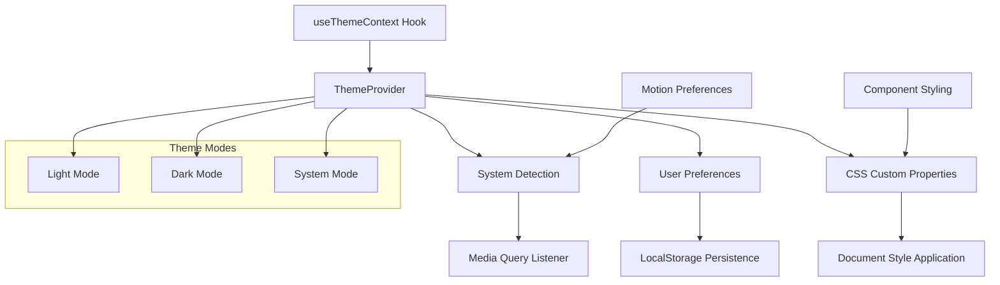
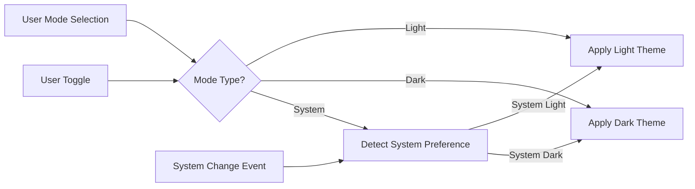
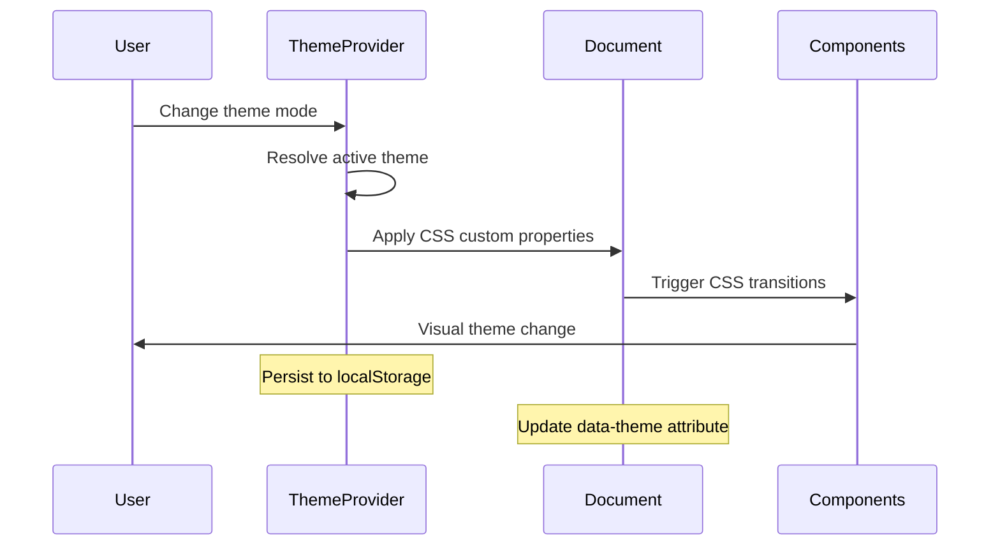

# Theme System Architecture

## Overview

The RrishMusic theme system provides a comprehensive solution for light/dark mode theming with system preference detection, accessibility support, and smooth transitions. The system uses CSS custom properties, React Context, and TypeScript for type safety.



## Architecture Components

### 1. **Theme Context Provider**

The `ThemeProvider` is the central component managing theme state and system integration:

```typescript
interface ThemeContextValue {
  mode: ThemeMode                    // 'light' | 'dark' | 'system'
  activeTheme: ActiveTheme          // 'light' | 'dark'
  systemTheme: ActiveTheme          // System's current theme
  reducedMotion: boolean            // User's motion preference
  themeConfig: ThemeConfig          // Complete theme configuration
  isInitialized: boolean            // Theme system ready state
  
  // Actions
  setTheme: (mode: ThemeMode) => void
  toggleTheme: () => void
  cycleTheme: () => void
  forceTransition: () => void
}
```

### 2. **Theme Mode Resolution**



### 3. **CSS Custom Properties System**

The theme system uses CSS custom properties for runtime theme switching:

```css
:root {
  /* Light theme variables */
  --color-primary: #1e40af;
  --color-primary-hover: #1e3a8a;
  --color-background: #ffffff;
  --color-text: #1f2937;
  
  /* Transition properties */
  --transition-duration-fast: 150ms;
  --transition-duration-normal: 300ms;
  --transition-easing-standard: cubic-bezier(0.4, 0.0, 0.2, 1);
}

[data-theme="dark"] {
  /* Dark theme overrides */
  --color-primary: #3b82f6;
  --color-primary-hover: #2563eb;
  --color-background: #0f172a;
  --color-text: #f8fafc;
}
```

## Theme Configuration

### **Theme Definition Structure**

```typescript
interface ThemeConfig {
  name: string
  colors: {
    primary: string
    primaryHover: string
    primaryActive: string
    secondary: string
    background: string
    backgroundSecondary: string
    text: string
    textSecondary: string
    textMuted: string
    border: string
    // ... additional color tokens
  }
  transitions: {
    durationFast: string
    durationNormal: string
    durationSlow: string
    easingStandard: string
    // ... timing configurations
  }
  shadows: {
    sm: string
    md: string
    lg: string
    xl: string
  }
}
```

### **Tailwind Integration**

The theme system integrates with Tailwind CSS through custom utilities:

```javascript
// tailwind.config.js
module.exports = {
  theme: {
    extend: {
      colors: {
        theme: {
          primary: 'var(--color-primary)',
          'primary-hover': 'var(--color-primary-hover)',
          bg: 'var(--color-background)',
          text: 'var(--color-text)',
          // ... theme-aware color tokens
        }
      },
      transitionDuration: {
        'theme-fast': 'var(--transition-duration-fast)',
        'theme-normal': 'var(--transition-duration-normal)',
      }
    }
  }
}
```

## System Integration

### 1. **System Preference Detection**

```typescript
const getSystemTheme = (): ActiveTheme => {
  if (typeof window === 'undefined') return 'light'
  
  return window.matchMedia('(prefers-color-scheme: dark)').matches
    ? 'dark'
    : 'light'
}

const createSystemThemeListener = (callback: (theme: ActiveTheme) => void) => {
  if (typeof window === 'undefined') return () => {}
  
  const mediaQuery = window.matchMedia('(prefers-color-scheme: dark)')
  
  const handleChange = (e: MediaQueryListEvent) => {
    callback(e.matches ? 'dark' : 'light')
  }
  
  mediaQuery.addEventListener('change', handleChange)
  
  return () => mediaQuery.removeEventListener('change', handleChange)
}
```

### 2. **Motion Preference Detection**

```typescript
const getMotionPreference = (): boolean => {
  if (typeof window === 'undefined') return false
  
  return window.matchMedia('(prefers-reduced-motion: reduce)').matches
}

const createMotionPreferenceListener = (callback: (reduced: boolean) => void) => {
  if (typeof window === 'undefined') return () => {}
  
  const mediaQuery = window.matchMedia('(prefers-reduced-motion: reduce)')
  
  const handleChange = (e: MediaQueryListEvent) => {
    callback(e.matches)
  }
  
  mediaQuery.addEventListener('change', handleChange)
  
  return () => mediaQuery.removeEventListener('change', handleChange)
}
```

### 3. **LocalStorage Persistence**

```typescript
const THEME_STORAGE_KEY = 'rrishmusic-theme-mode'

const saveThemeToStorage = (mode: ThemeMode): void => {
  try {
    localStorage.setItem(THEME_STORAGE_KEY, mode)
  } catch (error) {
    console.warn('Failed to save theme preference:', error)
  }
}

const loadThemeFromStorage = (): ThemeMode => {
  try {
    const stored = localStorage.getItem(THEME_STORAGE_KEY)
    if (stored && ['light', 'dark', 'system'].includes(stored)) {
      return stored as ThemeMode
    }
  } catch (error) {
    console.warn('Failed to load theme preference:', error)
  }
  
  return 'system' // Default to system preference
}
```

## Document Application

### **Theme Application Process**



```typescript
const applyThemeToDocument = (theme: ActiveTheme, force = false): void => {
  if (typeof document === 'undefined') return
  
  const root = document.documentElement
  const themeConfig = themes[theme]
  
  // Apply theme attribute for CSS targeting
  root.setAttribute('data-theme', theme)
  
  // Apply CSS custom properties
  Object.entries(themeConfig.colors).forEach(([key, value]) => {
    root.style.setProperty(`--color-${kebabCase(key)}`, value)
  })
  
  Object.entries(themeConfig.transitions).forEach(([key, value]) => {
    root.style.setProperty(`--transition-${kebabCase(key)}`, value)
  })
  
  // Force reflow if needed (for testing or immediate application)
  if (force) {
    root.offsetHeight // Trigger reflow
  }
}
```

## Component Usage Patterns

### 1. **Basic Theme Usage**

```typescript
import { useThemeContext } from '@/contexts/ThemeContext'

const ThemedComponent = () => {
  const { mode, activeTheme, toggleTheme } = useThemeContext()
  
  return (
    <div className="bg-theme-bg text-theme-text transition-theme duration-theme-normal">
      <p>Current mode: {mode}</p>
      <p>Active theme: {activeTheme}</p>
      <button 
        onClick={toggleTheme}
        className="bg-theme-primary text-white hover:bg-theme-primary-hover"
      >
        Toggle Theme
      </button>
    </div>
  )
}
```

### 2. **Advanced Theme Integration**

```typescript
const AdvancedThemedComponent = () => {
  const { 
    mode, 
    activeTheme, 
    reducedMotion, 
    themeConfig, 
    cycleTheme 
  } = useThemeContext()
  
  const animationDuration = reducedMotion ? 0 : 300
  
  return (
    <motion.div
      className="bg-theme-bg shadow-theme-lg"
      animate={{ 
        backgroundColor: themeConfig.colors.background 
      }}
      transition={{ 
        duration: animationDuration / 1000,
        ease: "easeInOut"
      }}
    >
      <button 
        onClick={cycleTheme}
        className={`
          px-4 py-2 rounded-lg
          bg-theme-primary hover:bg-theme-primary-hover
          text-white font-medium
          transition-theme duration-theme-normal
          ${reducedMotion ? '' : 'hover:scale-105'}
        `}
      >
        {mode === 'light' && '☀️ Light'}
        {mode === 'dark' && '🌙 Dark'}
        {mode === 'system' && '💻 System'}
      </button>
    </motion.div>
  )
}
```

## Animation Integration

### **Framer Motion with Theme Awareness**

```typescript
const ThemeAwareAnimation = () => {
  const { reducedMotion, themeConfig } = useThemeContext()
  
  const variants = {
    initial: { 
      opacity: 0, 
      y: reducedMotion ? 0 : 20 
    },
    animate: { 
      opacity: 1, 
      y: 0,
      transition: {
        duration: reducedMotion ? 0 : 0.5,
        ease: "easeOut"
      }
    }
  }
  
  return (
    <motion.div
      variants={variants}
      initial="initial"
      animate="animate"
      style={{
        backgroundColor: themeConfig.colors.background,
        color: themeConfig.colors.text
      }}
    >
      Content with theme-aware animations
    </motion.div>
  )
}
```

## Accessibility Features

### 1. **Reduced Motion Support**
- Respects `prefers-reduced-motion: reduce`
- Disables animations when requested
- Maintains functionality without motion

### 2. **High Contrast Considerations**
```css
@media (prefers-contrast: high) {
  :root {
    --color-border: #000000;
    --color-text: #000000;
  }
  
  [data-theme="dark"] {
    --color-border: #ffffff;
    --color-text: #ffffff;
  }
}
```

### 3. **Focus Management**
```css
.focus-visible-enhanced {
  @apply focus:outline-none focus-visible:ring-2 focus-visible:ring-theme-primary focus-visible:ring-offset-2 focus-visible:ring-offset-theme-bg;
}
```

## Testing Strategy

### **Theme Testing Patterns**

```typescript
// Mock theme context for testing
const mockThemeContext = {
  mode: 'light' as ThemeMode,
  activeTheme: 'light' as ActiveTheme,
  systemTheme: 'light' as ActiveTheme,
  reducedMotion: false,
  themeConfig: themes.light,
  isInitialized: true,
  setTheme: jest.fn(),
  toggleTheme: jest.fn(),
  cycleTheme: jest.fn(),
  forceTransition: jest.fn(),
}

// Test theme switching
describe('ThemeProvider', () => {
  it('applies correct theme classes', () => {
    render(
      <ThemeProvider>
        <TestComponent />
      </ThemeProvider>
    )
    
    expect(document.documentElement).toHaveAttribute('data-theme', 'light')
  })
  
  it('respects system preferences', () => {
    // Mock system dark mode
    Object.defineProperty(window, 'matchMedia', {
      writable: true,
      value: jest.fn().mockImplementation(query => ({
        matches: query === '(prefers-color-scheme: dark)',
        media: query,
        addListener: jest.fn(),
        removeListener: jest.fn(),
      })),
    })
    
    render(<ThemeProvider defaultMode="system" />)
    
    expect(document.documentElement).toHaveAttribute('data-theme', 'dark')
  })
})
```

## Performance Optimizations

### 1. **Prevent Flash of Unstyled Content (FOUC)**
```typescript
// Synchronous theme application on initial load
useEffect(() => {
  if (preventFOUC) {
    applyThemeToDocument(activeTheme, false)
  }
  
  const initTimer = setTimeout(() => {
    setIsInitialized(true)
  }, 50)
  
  return () => clearTimeout(initTimer)
}, [preventFOUC, activeTheme])
```

### 2. **Efficient Theme Transitions**
```css
/* Only transition specific properties */
.transition-theme {
  transition-property: background-color, border-color, color, fill, stroke, box-shadow;
  transition-timing-function: cubic-bezier(0.4, 0.0, 0.2, 1);
}
```

### 3. **Memory Management**
```typescript
// Cleanup event listeners on unmount
useEffect(() => {
  const cleanupSystemListener = createSystemThemeListener(setSystemTheme)
  const cleanupMotionListener = createMotionPreferenceListener(setReducedMotion)
  
  return () => {
    cleanupSystemListener()
    cleanupMotionListener()
  }
}, [])
```

---

**Last Updated**: August 2025  
**Related**: [Component Hierarchy](./component-hierarchy.md) | [Architecture Overview](./README.md)