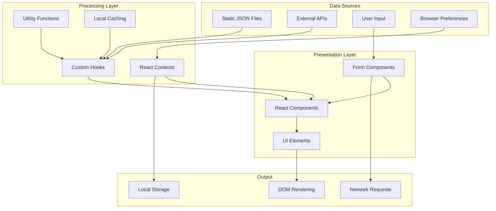
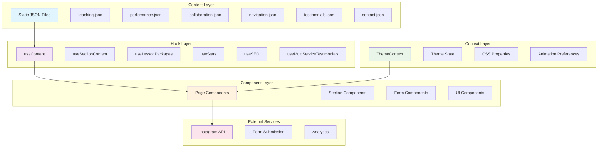

# RrishMusic Data Flow Documentation

This documentation provides a comprehensive overview of how data flows through the RrishMusic application, from static content files to user interactions and external API integrations.

## 📋 Table of Contents

- [Data Flow Overview](#data-flow-overview)
- [Architecture Diagram](#architecture-diagram)
- [Core Data Flow Patterns](#core-data-flow-patterns)
- [Detailed Flow Documentation](#detailed-flow-documentation)
- [Performance Considerations](#performance-considerations)
- [Debugging Data Flows](#debugging-data-flows)

## 🔄 Data Flow Overview

The RrishMusic application follows a **unidirectional data flow** pattern with multiple data sources and processing layers:



## 🏗️ Architecture Diagram



## 🔄 Core Data Flow Patterns

### 1. Static Content Flow
**Pattern**: JSON Files → Custom Hooks → Components → UI

```typescript
// Content files define structured data
src/content/teaching.json → useContent() → Component → Rendered UI
```

### 2. Theme Data Flow
**Pattern**: Browser Preferences → Theme Context → CSS Custom Properties → Components

```typescript
// Theme preferences flow through context
System/User Preference → ThemeProvider → CSS Variables → Component Styling
```

### 3. Form Data Flow
**Pattern**: User Input → Form State → Validation → Submission → Feedback

```typescript
// Form interactions with validation
User Input → useState → Validation → API Call → UI Feedback
```

### 4. Navigation Data Flow
**Pattern**: Route Changes → Navigation State → Component Rendering → SEO Updates

```typescript
// Route-based data updates
URL Change → Router → Page Component → SEO Metadata → Document Updates
```

## 📚 Detailed Flow Documentation

| Component | Description | Details |
|-----------|-------------|---------|
| [Content Management System](./content-system.md) | JSON-based content flow through custom hooks | Static content → hooks → components |
| [Form Data Flow](./forms.md) | User input handling and validation | Input → validation → submission → feedback |
| [State Management](./state-management.md) | Application state patterns and contexts | Theme, navigation, and component state |
| [External Integrations](./external-apis.md) | Instagram API and third-party services | API calls → data processing → UI updates |

## ⚡ Performance Considerations

### Data Flow Optimization Strategies

1. **Lazy Loading**: Components and sections load on demand
2. **Memoization**: Expensive calculations are cached using React.memo and useMemo
3. **Context Optimization**: Theme context prevents unnecessary re-renders
4. **Static Imports**: JSON content is bundled at build time for fast access

### Key Performance Patterns

```typescript
// Memoized content calculations
const memoizedContent = useMemo(() => 
  processContent(rawContent), [rawContent]
)

// Lazy section loading
const LazySection = lazy(() => import('./Section'))

// Optimized context usage
const { theme } = useTheme() // Only subscribes to theme changes
```

## 🐛 Debugging Data Flows

### Common Data Flow Issues

1. **Missing Content**: Check JSON file imports and hook implementations
2. **Theme Not Applying**: Verify ThemeProvider wrapper and CSS custom properties
3. **Form Validation Errors**: Review validation logic and error state handling
4. **Navigation Issues**: Check route definitions and navigation data structure

### Debug Tools and Techniques

```typescript
// Enable development mode logging
const DEBUG_CONTENT = process.env.NODE_ENV === 'development'

// Hook debugging pattern
export const useContent = () => {
  const content = useMemo(() => {
    const processed = processContent(rawContent)
    if (DEBUG_CONTENT) console.log('Content processed:', processed)
    return processed
  }, [rawContent])
  
  return content
}
```

### Debugging Commands

```bash
# Check for content import issues
npm run build 2>&1 | grep -i "can't resolve"

# Verify JSON structure
npm run lint -- --ext .json

# Test data flow in development
npm run dev
# Open browser dev tools → Components tab → Select component → Check props/state
```

## 🔍 Data Flow Monitoring

### Development Monitoring

- **React Developer Tools**: Inspect component props and state
- **Network Tab**: Monitor API calls and response times
- **Console Logging**: Track data transformations in development mode
- **Performance Tab**: Identify render bottlenecks

### Production Monitoring

- **Error Boundaries**: Catch and report data flow errors
- **Analytics Integration**: Track user interactions and content engagement
- **Performance Metrics**: Monitor loading times and interaction delays

---

**Next Steps**: Choose a specific data flow area to explore:

- 📄 [Content Management System](./content-system.md) - Deep dive into JSON content flows
- 📝 [Form Data Handling](./forms.md) - Complete form lifecycle documentation  
- 🎨 [State Management](./state-management.md) - Context and state patterns
- 🔌 [External APIs](./external-apis.md) - Third-party service integrations

---

**Last Updated**: August 2025  
**Version**: 1.0.0  
**Maintainer**: RrishMusic Development Team