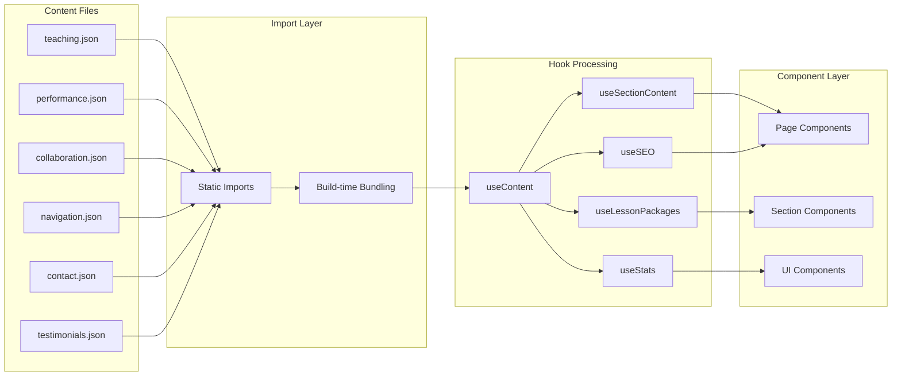
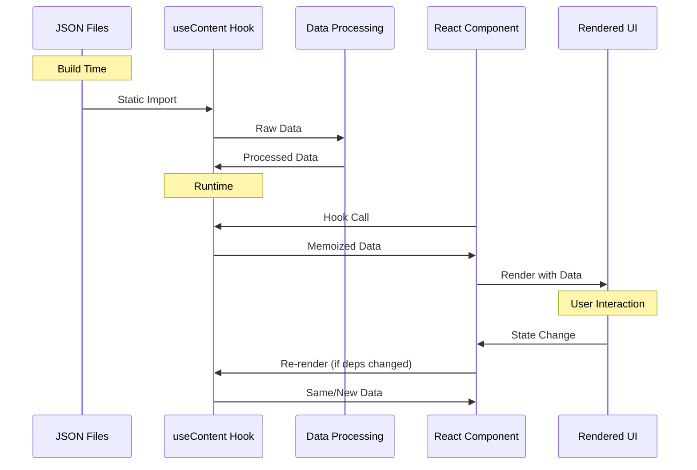
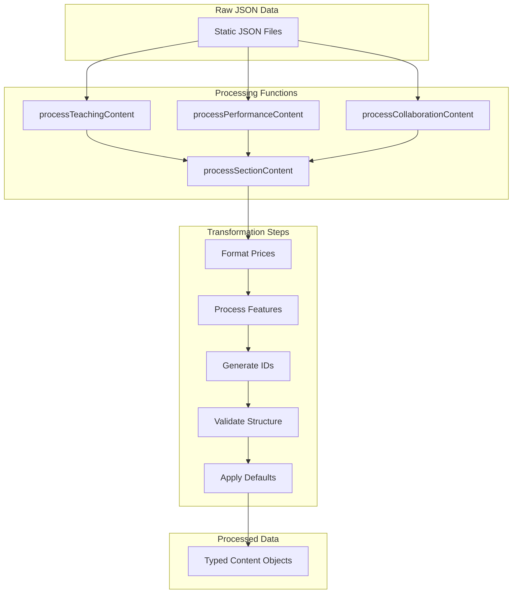

# Content Management System Data Flow

This document details how static JSON content flows through the RrishMusic application via custom hooks and components.

## 📋 Table of Contents

- [Architecture Overview](#architecture-overview)
- [Content Structure](#content-structure)
- [Hook System](#hook-system)
- [Component Integration](#component-integration)
- [Data Transformations](#data-transformations)
- [Performance Optimizations](#performance-optimizations)

## 🏗️ Architecture Overview

The content management system follows a **JSON → Hook → Component** pattern:



## 📁 Content Structure

### Core Content Files

```
src/content/
├── teaching.json              # Teaching service content
├── performance.json           # Performance service content  
├── collaboration.json         # Collaboration service content
├── navigation.json           # Navigation menu data
├── contact.json              # Contact form configurations
├── testimonials.json         # Customer testimonials
├── performance-gallery.json  # Performance media assets
├── instagram-posts.json      # Instagram integration data
├── serviceConfiguration.json # Multi-service settings
└── ui/
    └── cta.json             # Call-to-action configurations
```

### Content Schema Examples

#### Teaching Content Structure
```json
{
  "hero": {
    "title": "Professional Guitar Lessons",
    "subtitle": "Learn from an experienced musician",
    "description": "Personalized guitar instruction...",
    "cta": {
      "primary": "Book Lesson",
      "secondary": "Learn More"
    }
  },
  "sections": {
    "approach": {
      "title": "Teaching Approach",
      "content": [...]
    },
    "packages": {
      "title": "Lesson Packages", 
      "items": [...]
    }
  }
}
```

#### Performance Content Structure
```json
{
  "hero": {
    "title": "Live Performances",
    "subtitle": "Bringing music to life",
    "services": [...]
  },
  "gallery": {
    "featured": [...],
    "venues": [...],
    "testimonials": [...]
  }
}
```

## 🎣 Hook System

### Primary Content Hook: `useContent()`

**Location**: `src/hooks/useContent.ts`

```typescript
export const useContent = () => {
  // Static imports at module level
  const teachingContent = useMemo(() => 
    processTeachingContent(teachingContentRaw), []
  )
  
  const performanceContent = useMemo(() => 
    processPerformanceContent(performanceContentRaw), []
  )
  
  const collaborationContent = useMemo(() => 
    processCollaborationContent(collaborationContentRaw), []
  )
  
  return {
    teaching: teachingContent,
    performance: performanceContent,
    collaboration: collaborationContent,
    navigation: navigationData,
    contact: contactContent
  }
}
```

### Data Flow Through Hooks



### Specialized Content Hooks

#### 1. Section Content Hook
```typescript
export const useSectionContent = (service: ServiceType, section: string) => {
  const { [service]: serviceContent } = useContent()
  
  return useMemo(() => {
    const sectionData = serviceContent.sections?.[section]
    return processSectionContent(sectionData)
  }, [serviceContent, section])
}
```

#### 2. Lesson Packages Hook
```typescript
export const useLessonPackages = () => {
  const { teaching } = useContent()
  
  return useMemo(() => {
    return teaching.sections.packages?.items?.map(pkg => ({
      ...pkg,
      priceFormatted: formatPrice(pkg.price),
      featuresProcessed: processFeatures(pkg.features)
    }))
  }, [teaching])
}
```

#### 3. SEO Content Hook  
```typescript
export const useSEO = (page: PageType) => {
  const content = useContent()
  
  return useMemo(() => {
    const pageContent = content[page]
    return {
      title: pageContent.seo?.title || pageContent.hero?.title,
      description: pageContent.seo?.description || pageContent.hero?.subtitle,
      keywords: pageContent.seo?.keywords || [],
      ogImage: pageContent.seo?.ogImage
    }
  }, [content, page])
}
```

## 🔧 Component Integration

### Page-Level Integration

```typescript
// src/components/pages/Teaching.tsx
import { useSectionContent, useLessonPackages } from '@/hooks/useContent'

export const Teaching: React.FC = () => {
  const heroContent = useSectionContent('teaching', 'hero')
  const packages = useLessonPackages()
  const approachContent = useSectionContent('teaching', 'approach')
  
  return (
    <div>
      <Hero content={heroContent} />
      <Approach content={approachContent} />
      <Packages packages={packages} />
    </div>
  )
}
```

### Section-Level Integration

```typescript
// src/components/sections/Approach.tsx
import { useSectionContent } from '@/hooks/useContent'

interface ApproachProps {
  service?: ServiceType
}

export const Approach: React.FC<ApproachProps> = ({ 
  service = 'teaching' 
}) => {
  const content = useSectionContent(service, 'approach')
  
  if (!content) return null
  
  return (
    <section>
      <h2>{content.title}</h2>
      <div>{content.description}</div>
      {content.points?.map(point => (
        <div key={point.id}>{point.text}</div>
      ))}
    </section>
  )
}
```

### Multi-Service Content Integration

```typescript
// src/components/sections/MultiServiceTestimonialsSection.tsx
import { useMultiServiceTestimonials } from '@/hooks/useMultiServiceTestimonials'

export const MultiServiceTestimonialsSection: React.FC = () => {
  const {
    testimonials,
    serviceConfig,
    getTestimonialsByService,
    getFeaturedTestimonials
  } = useMultiServiceTestimonials()
  
  const featuredTestimonials = getFeaturedTestimonials(3)
  
  return (
    <section>
      {featuredTestimonials.map(testimonial => (
        <TestimonialCard 
          key={testimonial.id} 
          testimonial={testimonial}
          serviceConfig={serviceConfig[testimonial.service]}
        />
      ))}
    </section>
  )
}
```

## 🔄 Data Transformations

### Content Processing Pipeline



### Example Transformations

#### Price Formatting
```typescript
const formatPrice = (price: number | string): string => {
  const numPrice = typeof price === 'string' ? parseFloat(price) : price
  return new Intl.NumberFormat('en-US', {
    style: 'currency',
    currency: 'USD',
    minimumFractionDigits: 0
  }).format(numPrice)
}
```

#### Feature Processing
```typescript
const processFeatures = (features: string[]): ProcessedFeature[] => {
  return features.map((feature, index) => ({
    id: `feature-${index}`,
    text: feature,
    icon: getFeatureIcon(feature),
    highlighted: isHighlightedFeature(feature)
  }))
}
```

#### Content Validation
```typescript
const validateSectionContent = (content: any): boolean => {
  return (
    content &&
    typeof content.title === 'string' &&
    content.title.length > 0 &&
    (content.description || content.items || content.content)
  )
}
```

## ⚡ Performance Optimizations

### 1. Static Import Optimization

```typescript
// All imports happen at build time
import teachingContentRaw from '../content/teaching.json'
import performanceContentRaw from '../content/performance.json'
import collaborationContentRaw from '../content/collaboration.json'

// No dynamic imports or fetch calls needed
// Content is bundled with the application
```

### 2. Memoization Strategy

```typescript
export const useContent = () => {
  // Expensive processing is memoized
  const teachingContent = useMemo(() => 
    processTeachingContent(teachingContentRaw), 
    [] // Empty dependency - only processes once
  )
  
  const performanceContent = useMemo(() => 
    processPerformanceContent(performanceContentRaw), 
    []
  )
  
  // Return stable object reference
  return useMemo(() => ({
    teaching: teachingContent,
    performance: performanceContent,
    collaboration: collaborationContent,
    navigation: navigationData,
    contact: contactContent
  }), [teachingContent, performanceContent, collaborationContent])
}
```

### 3. Selective Content Loading

```typescript
export const useSectionContent = (service: ServiceType, section: string) => {
  const { [service]: serviceContent } = useContent()
  
  // Only process the specific section requested
  return useMemo(() => {
    const sectionData = serviceContent.sections?.[section]
    return sectionData ? processSectionContent(sectionData) : null
  }, [serviceContent, section])
}
```

### 4. Component-Level Optimization

```typescript
// Memoize expensive components
export const Approach = React.memo<ApproachProps>(({ service = 'teaching' }) => {
  const content = useSectionContent(service, 'approach')
  
  if (!content) return null
  
  return (
    <section>
      <h2>{content.title}</h2>
      {/* Render optimized content */}
    </section>
  )
})
```

## 🐛 Debugging Content Flow

### Common Issues and Solutions

#### 1. Content Not Loading
```typescript
// Debug hook in useContent
export const useContent = () => {
  const result = useMemo(() => {
    console.log('Processing content...', {
      teaching: !!teachingContentRaw,
      performance: !!performanceContentRaw,
      collaboration: !!collaborationContentRaw
    })
    
    return processAllContent()
  }, [])
  
  return result
}
```

#### 2. Missing Section Data
```typescript
export const useSectionContent = (service: ServiceType, section: string) => {
  const { [service]: serviceContent } = useContent()
  
  const result = useMemo(() => {
    if (!serviceContent) {
      console.warn(`Service content not found: ${service}`)
      return null
    }
    
    const sectionData = serviceContent.sections?.[section]
    if (!sectionData) {
      console.warn(`Section not found: ${service}.${section}`)
      return null
    }
    
    return processSectionContent(sectionData)
  }, [serviceContent, service, section])
  
  return result
}
```

#### 3. Type Safety Issues
```typescript
// Use TypeScript for runtime validation
interface ContentSection {
  title: string
  description?: string
  items?: ContentItem[]
}

const validateContentSection = (data: any): data is ContentSection => {
  return (
    typeof data === 'object' &&
    typeof data.title === 'string' &&
    data.title.length > 0
  )
}
```

### Development Tools

```bash
# Validate JSON structure
npm run lint -- --ext .json

# Check for unused content
grep -r "import.*json" src/ | sort | uniq

# Verify all content imports
npm run build 2>&1 | grep -i "can't resolve.*json"
```

---

**Related Documentation**:
- [Form Data Flow](./forms.md) - Form handling and validation
- [State Management](./state-management.md) - Application state patterns
- [External APIs](./external-apis.md) - Third-party integrations

**Last Updated**: August 2025