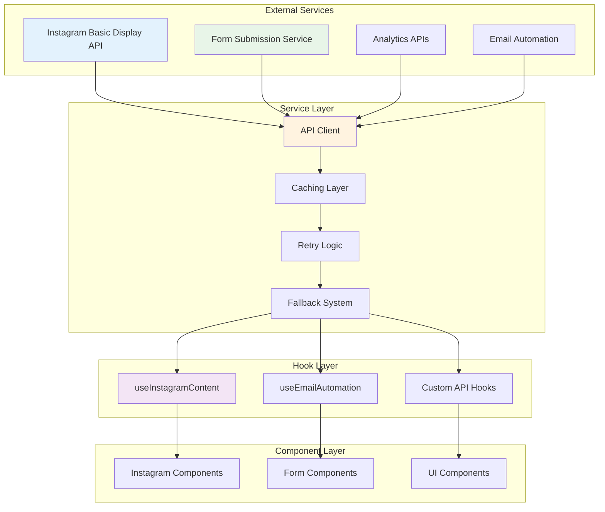
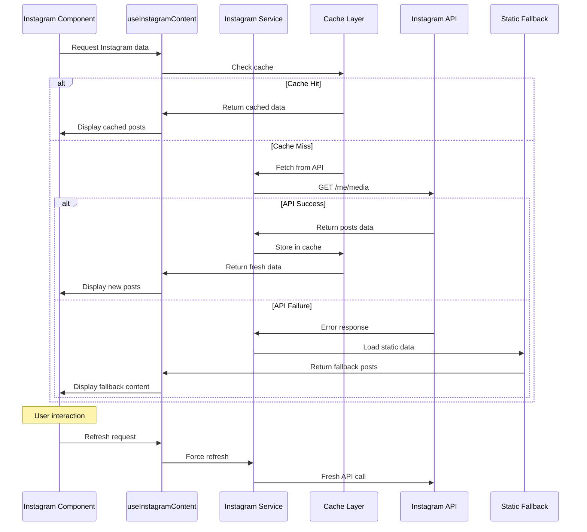
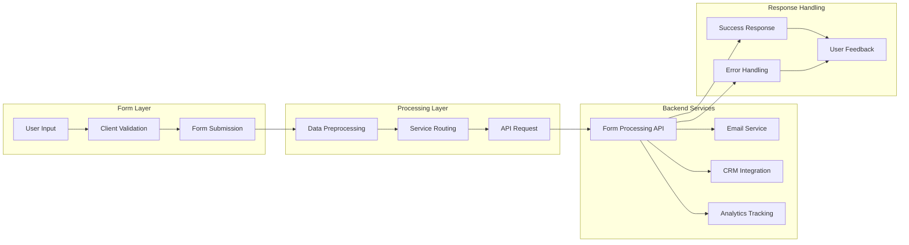

# External APIs Data Flow

This document details how external API integrations flow through the RrishMusic application, including Instagram API, form submissions, and third-party services.

## 📋 Table of Contents

- [API Architecture Overview](#api-architecture-overview)
- [Instagram API Integration](#instagram-api-integration)
- [Form Submission APIs](#form-submission-apis)
- [Caching and Performance](#caching-and-performance)
- [Error Handling and Fallbacks](#error-handling-and-fallbacks)
- [Rate Limiting and Throttling](#rate-limiting-and-throttling)
- [Security Considerations](#security-considerations)

## 🏗️ API Architecture Overview

The RrishMusic application integrates with multiple external APIs following a **layered service architecture**:



## 📸 Instagram API Integration

### Instagram Service Architecture

**File**: `src/services/instagram.ts`

```typescript
interface InstagramPost {
  id: string
  media_type: 'IMAGE' | 'VIDEO' | 'CAROUSEL_ALBUM'
  media_url: string
  thumbnail_url?: string
  permalink: string
  caption?: string
  timestamp: string
  username: string
}

interface InstagramApiResponse {
  data: InstagramPost[]
  paging?: {
    cursors: {
      before: string
      after: string
    }
    next?: string
  }
}
```

### Instagram Data Flow



### Instagram Service Implementation

```typescript
class InstagramService {
  private readonly BASE_URL = 'https://graph.instagram.com'
  private readonly ACCESS_TOKEN = import.meta.env.VITE_INSTAGRAM_ACCESS_TOKEN
  
  private cache = new Map<string, CacheEntry>()
  private readonly CACHE_DURATION = 30 * 60 * 1000 // 30 minutes
  
  async getUserMedia(limit: number = 12): Promise<InstagramPost[]> {
    try {
      // Check cache first
      const cacheKey = `user_media_${limit}`
      const cached = this.getCachedData(cacheKey)
      if (cached) {
        return cached
      }
      
      // Fetch from API
      const url = `${this.BASE_URL}/me/media`
      const params = new URLSearchParams({
        fields: 'id,media_type,media_url,thumbnail_url,permalink,caption,timestamp,username',
        limit: limit.toString(),
        access_token: this.ACCESS_TOKEN
      })
      
      const response = await this.fetchWithRetry(`${url}?${params}`)
      const data: InstagramApiResponse = await response.json()
      
      // Process and cache the data
      const posts = this.processInstagramPosts(data.data)
      this.setCachedData(cacheKey, posts)
      
      return posts
      
    } catch (error) {
      console.error('Instagram API error:', error)
      return this.getFallbackData(limit)
    }
  }
  
  private async fetchWithRetry(
    url: string, 
    options: RequestInit = {}, 
    maxRetries: number = 3
  ): Promise<Response> {
    let lastError: Error
    
    for (let attempt = 1; attempt <= maxRetries; attempt++) {
      try {
        const response = await fetch(url, {
          ...options,
          headers: {
            'Content-Type': 'application/json',
            ...options.headers
          }
        })
        
        if (!response.ok) {
          throw new Error(`HTTP ${response.status}: ${response.statusText}`)
        }
        
        return response
      } catch (error) {
        lastError = error as Error
        
        if (attempt < maxRetries) {
          // Exponential backoff
          await new Promise(resolve => 
            setTimeout(resolve, Math.pow(2, attempt) * 1000)
          )
        }
      }
    }
    
    throw lastError!
  }
  
  private processInstagramPosts(rawPosts: any[]): InstagramPost[] {
    return rawPosts
      .filter(post => post.media_type === 'IMAGE') // Only images for now
      .map(post => ({
        id: post.id,
        media_type: post.media_type,
        media_url: post.media_url,
        thumbnail_url: post.thumbnail_url,
        permalink: post.permalink,
        caption: this.processCaption(post.caption),
        timestamp: post.timestamp,
        username: post.username || 'rrishmusic'
      }))
      .slice(0, 12) // Limit to 12 posts
  }
  
  private getFallbackData(limit: number): InstagramPost[] {
    // Load from static JSON file when API fails
    return staticInstagramPosts.slice(0, limit)
  }
}

export const instagramService = new InstagramService()
```

### Instagram Hook Implementation

```typescript
// src/hooks/useInstagramContent.ts
export const useInstagramContent = (limit: number = 12) => {
  const [state, setState] = useState<{
    posts: InstagramPost[]
    loading: boolean
    error: string | null
    lastUpdated: Date | null
  }>({
    posts: [],
    loading: true,
    error: null,
    lastUpdated: null
  })
  
  const fetchPosts = useCallback(async (forceRefresh = false) => {
    try {
      setState(prev => ({ ...prev, loading: true, error: null }))
      
      const posts = await instagramService.getUserMedia(limit)
      
      setState({
        posts,
        loading: false,
        error: null,
        lastUpdated: new Date()
      })
      
    } catch (error) {
      setState(prev => ({
        ...prev,
        loading: false,
        error: error instanceof Error ? error.message : 'Failed to load Instagram content'
      }))
    }
  }, [limit])
  
  // Initial load
  useEffect(() => {
    fetchPosts()
  }, [fetchPosts])
  
  // Refresh capability
  const refresh = useCallback(() => {
    fetchPosts(true)
  }, [fetchPosts])
  
  return {
    ...state,
    refresh,
    hasError: !!state.error,
    isEmpty: state.posts.length === 0 && !state.loading
  }
}
```

## 📝 Form Submission APIs

### Form Submission Data Flow



### Form Submission Service

```typescript
// src/services/formSubmission.ts
interface FormSubmissionData {
  service: ServiceType
  formType: 'teaching' | 'performance' | 'collaboration' | 'contact'
  timestamp: string
  data: Record<string, any>
  metadata: {
    userAgent: string
    referrer: string
    sessionId: string
  }
}

class FormSubmissionService {
  private readonly API_BASE_URL = import.meta.env.VITE_API_BASE_URL || '/api'
  
  async submitInquiry<T extends InquiryData>(
    formType: string,
    data: T,
    options: SubmissionOptions = {}
  ): Promise<SubmissionResult> {
    
    const submissionData: FormSubmissionData = {
      service: this.inferServiceFromFormType(formType),
      formType: formType as any,
      timestamp: new Date().toISOString(),
      data: this.sanitizeFormData(data),
      metadata: {
        userAgent: navigator.userAgent,
        referrer: document.referrer,
        sessionId: this.getSessionId()
      }
    }
    
    try {
      // Pre-submission validation
      await this.validateSubmission(submissionData)
      
      // Submit to primary endpoint
      const response = await this.submitToPrimary(submissionData, options)
      
      // Handle successful submission
      await this.handleSuccess(response, submissionData)
      
      return {
        success: true,
        message: 'Your inquiry has been sent successfully!',
        data: response
      }
      
    } catch (error) {
      console.error('Form submission error:', error)
      
      // Attempt fallback submission
      const fallbackResult = await this.attemptFallback(submissionData, error)
      
      if (fallbackResult.success) {
        return fallbackResult
      }
      
      // Final error state
      return {
        success: false,
        message: this.getErrorMessage(error),
        error: error instanceof Error ? error.message : 'Unknown error'
      }
    }
  }
  
  private async submitToPrimary(
    data: FormSubmissionData,
    options: SubmissionOptions
  ): Promise<any> {
    const endpoint = `${this.API_BASE_URL}/inquiries/${data.formType}`
    
    const response = await fetch(endpoint, {
      method: 'POST',
      headers: {
        'Content-Type': 'application/json',
        'X-Form-Type': data.formType,
        'X-Timestamp': data.timestamp,
        ...options.headers
      },
      body: JSON.stringify(data)
    })
    
    if (!response.ok) {
      const errorData = await response.json().catch(() => ({}))
      throw new Error(
        errorData.message || `HTTP ${response.status}: ${response.statusText}`
      )
    }
    
    return response.json()
  }
  
  private async attemptFallback(
    data: FormSubmissionData,
    originalError: unknown
  ): Promise<SubmissionResult> {
    try {
      // Fallback to generic contact endpoint
      const fallbackResponse = await fetch(`${this.API_BASE_URL}/contact`, {
        method: 'POST',
        headers: { 'Content-Type': 'application/json' },
        body: JSON.stringify({
          ...data,
          fallback: true,
          originalError: originalError instanceof Error ? originalError.message : 'Unknown'
        })
      })
      
      if (fallbackResponse.ok) {
        return {
          success: true,
          message: 'Your message has been sent via backup system.',
          warning: 'Some features may be limited.'
        }
      }
    } catch (fallbackError) {
      console.error('Fallback submission failed:', fallbackError)
    }
    
    // Final fallback - local storage for later retry
    this.saveForRetry(data)
    
    return {
      success: false,
      message: 'Unable to send message. Your inquiry has been saved and will be sent when connection is restored.',
      error: 'Network connectivity issue'
    }
  }
  
  private sanitizeFormData(data: Record<string, any>): Record<string, any> {
    const sanitized = { ...data }
    
    // Remove sensitive fields that shouldn't be transmitted
    delete sanitized.password
    delete sanitized.creditCard
    
    // Sanitize text fields
    Object.keys(sanitized).forEach(key => {
      if (typeof sanitized[key] === 'string') {
        sanitized[key] = sanitized[key].trim()
        // Basic XSS prevention
        sanitized[key] = sanitized[key].replace(/<script\b[^<]*(?:(?!<\/script>)<[^<]*)*<\/script>/gi, '')
      }
    })
    
    return sanitized
  }
}

export const formSubmissionService = new FormSubmissionService()
```

### Form Submission Hook

```typescript
// src/hooks/useFormSubmission.ts
export const useFormSubmission = <T extends InquiryData>(
  formType: string
) => {
  const [state, setState] = useState<{
    isSubmitting: boolean
    lastResult: SubmissionResult | null
    retryCount: number
  }>({
    isSubmitting: false,
    lastResult: null,
    retryCount: 0
  })
  
  const submit = useCallback(async (
    data: T,
    options: SubmissionOptions = {}
  ) => {
    setState(prev => ({ ...prev, isSubmitting: true }))
    
    try {
      const result = await formSubmissionService.submitInquiry(
        formType,
        data,
        options
      )
      
      setState(prev => ({
        ...prev,
        isSubmitting: false,
        lastResult: result,
        retryCount: result.success ? 0 : prev.retryCount + 1
      }))
      
      return result
      
    } catch (error) {
      const errorResult: SubmissionResult = {
        success: false,
        message: 'Submission failed',
        error: error instanceof Error ? error.message : 'Unknown error'
      }
      
      setState(prev => ({
        ...prev,
        isSubmitting: false,
        lastResult: errorResult,
        retryCount: prev.retryCount + 1
      }))
      
      return errorResult
    }
  }, [formType])
  
  const retry = useCallback(async (data: T) => {
    if (state.retryCount < 3) {
      return submit(data)
    } else {
      throw new Error('Maximum retry attempts exceeded')
    }
  }, [submit, state.retryCount])
  
  return {
    ...state,
    submit,
    retry,
    canRetry: state.retryCount < 3,
    hasError: state.lastResult && !state.lastResult.success
  }
}
```

## ⚡ Caching and Performance

### Multi-Level Caching Strategy

```typescript
// src/utils/cache.ts
interface CacheEntry<T = any> {
  data: T
  timestamp: number
  ttl: number
  metadata?: Record<string, any>
}

class CacheManager {
  private memoryCache = new Map<string, CacheEntry>()
  private readonly DEFAULT_TTL = 5 * 60 * 1000 // 5 minutes
  
  // Memory cache (fastest)
  set<T>(key: string, data: T, ttl: number = this.DEFAULT_TTL): void {
    const entry: CacheEntry<T> = {
      data,
      timestamp: Date.now(),
      ttl,
      metadata: { source: 'memory' }
    }
    
    this.memoryCache.set(key, entry)
    
    // Also store in localStorage for persistence
    try {
      localStorage.setItem(`cache_${key}`, JSON.stringify(entry))
    } catch (error) {
      console.warn('Failed to persist cache to localStorage:', error)
    }
  }
  
  get<T>(key: string): T | null {
    // Check memory cache first
    const memoryEntry = this.memoryCache.get(key)
    if (memoryEntry && this.isValid(memoryEntry)) {
      return memoryEntry.data
    }
    
    // Check localStorage
    try {
      const stored = localStorage.getItem(`cache_${key}`)
      if (stored) {
        const entry: CacheEntry<T> = JSON.parse(stored)
        if (this.isValid(entry)) {
          // Restore to memory cache
          this.memoryCache.set(key, entry)
          return entry.data
        }
      }
    } catch (error) {
      console.warn('Failed to read from localStorage cache:', error)
    }
    
    return null
  }
  
  private isValid(entry: CacheEntry): boolean {
    return Date.now() - entry.timestamp < entry.ttl
  }
  
  invalidate(pattern: string | RegExp): void {
    // Clear from memory cache
    for (const key of this.memoryCache.keys()) {
      if (
        (typeof pattern === 'string' && key.includes(pattern)) ||
        (pattern instanceof RegExp && pattern.test(key))
      ) {
        this.memoryCache.delete(key)
      }
    }
    
    // Clear from localStorage
    try {
      for (let i = localStorage.length - 1; i >= 0; i--) {
        const key = localStorage.key(i)
        if (key?.startsWith('cache_')) {
          const cacheKey = key.substring(6)
          if (
            (typeof pattern === 'string' && cacheKey.includes(pattern)) ||
            (pattern instanceof RegExp && pattern.test(cacheKey))
          ) {
            localStorage.removeItem(key)
          }
        }
      }
    } catch (error) {
      console.warn('Failed to clear localStorage cache:', error)
    }
  }
}

export const cacheManager = new CacheManager()
```

### Smart Cache Invalidation

```typescript
// src/hooks/useSmartCache.ts
export const useSmartCache = <T>(
  key: string,
  fetcher: () => Promise<T>,
  options: CacheOptions = {}
) => {
  const {
    ttl = 5 * 60 * 1000, // 5 minutes default
    staleWhileRevalidate = false,
    refreshInterval,
    dependencies = []
  } = options
  
  const [state, setState] = useState<{
    data: T | null
    loading: boolean
    error: Error | null
    lastFetch: Date | null
  }>({
    data: null,
    loading: true,
    error: null,
    lastFetch: null
  })
  
  const fetchData = useCallback(async (forceRefresh = false) => {
    try {
      // Check cache first (unless forcing refresh)
      if (!forceRefresh) {
        const cached = cacheManager.get<T>(key)
        if (cached) {
          setState(prev => ({
            ...prev,
            data: cached,
            loading: false,
            error: null
          }))
          
          // If using stale-while-revalidate, continue to fetch fresh data
          if (!staleWhileRevalidate) {
            return
          }
        }
      }
      
      // Fetch fresh data
      const data = await fetcher()
      
      // Cache the result
      cacheManager.set(key, data, ttl)
      
      setState({
        data,
        loading: false,
        error: null,
        lastFetch: new Date()
      })
      
    } catch (error) {
      setState(prev => ({
        ...prev,
        loading: false,
        error: error instanceof Error ? error : new Error('Unknown error')
      }))
    }
  }, [key, fetcher, ttl, staleWhileRevalidate])
  
  // Initial fetch and dependency-based refetch
  useEffect(() => {
    fetchData()
  }, [fetchData, ...dependencies])
  
  // Refresh interval
  useEffect(() => {
    if (refreshInterval) {
      const interval = setInterval(() => {
        fetchData()
      }, refreshInterval)
      
      return () => clearInterval(interval)
    }
  }, [fetchData, refreshInterval])
  
  const refresh = useCallback(() => {
    fetchData(true)
  }, [fetchData])
  
  const invalidate = useCallback(() => {
    cacheManager.invalidate(key)
    setState(prev => ({ ...prev, data: null, loading: true }))
    fetchData(true)
  }, [key, fetchData])
  
  return {
    ...state,
    refresh,
    invalidate,
    isCached: !!cacheManager.get(key)
  }
}
```

## 🛡️ Error Handling and Fallbacks

### Comprehensive Error Handling

```typescript
// src/utils/apiErrorHandling.ts
export enum ApiErrorType {
  NETWORK_ERROR = 'network_error',
  RATE_LIMIT = 'rate_limit',
  AUTHENTICATION = 'authentication',
  VALIDATION = 'validation',
  SERVER_ERROR = 'server_error',
  UNKNOWN = 'unknown'
}

export class ApiError extends Error {
  public readonly type: ApiErrorType
  public readonly statusCode?: number
  public readonly retryable: boolean
  public readonly userMessage: string
  
  constructor(
    type: ApiErrorType,
    message: string,
    statusCode?: number,
    userMessage?: string
  ) {
    super(message)
    this.name = 'ApiError'
    this.type = type
    this.statusCode = statusCode
    this.retryable = this.determineRetryability(type, statusCode)
    this.userMessage = userMessage || this.getDefaultUserMessage(type)
  }
  
  private determineRetryability(type: ApiErrorType, statusCode?: number): boolean {
    if (statusCode) {
      // 4xx errors are generally not retryable (except 429)
      if (statusCode >= 400 && statusCode < 500) {
        return statusCode === 429 // Rate limit
      }
      
      // 5xx errors are usually retryable
      if (statusCode >= 500) {
        return true
      }
    }
    
    switch (type) {
      case ApiErrorType.NETWORK_ERROR:
      case ApiErrorType.RATE_LIMIT:
      case ApiErrorType.SERVER_ERROR:
        return true
      default:
        return false
    }
  }
  
  private getDefaultUserMessage(type: ApiErrorType): string {
    switch (type) {
      case ApiErrorType.NETWORK_ERROR:
        return 'Please check your internet connection and try again.'
      case ApiErrorType.RATE_LIMIT:
        return 'Too many requests. Please wait a moment before trying again.'
      case ApiErrorType.AUTHENTICATION:
        return 'Authentication failed. Please refresh the page.'
      case ApiErrorType.VALIDATION:
        return 'Please check your information and try again.'
      case ApiErrorType.SERVER_ERROR:
        return 'We\'re experiencing technical difficulties. Please try again later.'
      default:
        return 'An unexpected error occurred. Please try again.'
    }
  }
}

export const handleApiError = (error: unknown): ApiError => {
  if (error instanceof ApiError) {
    return error
  }
  
  if (error instanceof Error) {
    // Network errors
    if (error.message.includes('fetch') || error.message.includes('network')) {
      return new ApiError(
        ApiErrorType.NETWORK_ERROR,
        error.message,
        undefined,
        'Network connection failed. Please check your internet connection.'
      )
    }
    
    // Parse HTTP errors
    const statusMatch = error.message.match(/HTTP (\d+)/)
    if (statusMatch) {
      const statusCode = parseInt(statusMatch[1])
      const type = statusCode === 429 
        ? ApiErrorType.RATE_LIMIT
        : statusCode >= 500 
        ? ApiErrorType.SERVER_ERROR
        : statusCode === 401 || statusCode === 403
        ? ApiErrorType.AUTHENTICATION
        : statusCode >= 400
        ? ApiErrorType.VALIDATION
        : ApiErrorType.UNKNOWN
      
      return new ApiError(type, error.message, statusCode)
    }
  }
  
  return new ApiError(
    ApiErrorType.UNKNOWN,
    error instanceof Error ? error.message : 'Unknown error'
  )
}
```

### Fallback Data Strategies

```typescript
// src/utils/fallbackStrategies.ts
interface FallbackStrategy<T> {
  staticData?: T
  cacheFallback?: boolean
  degradedMode?: () => T
  userMessage?: string
}

class FallbackManager {
  private strategies = new Map<string, FallbackStrategy<any>>()
  
  registerStrategy<T>(key: string, strategy: FallbackStrategy<T>): void {
    this.strategies.set(key, strategy)
  }
  
  async executeFallback<T>(
    key: string,
    originalError: ApiError,
    context?: any
  ): Promise<T> {
    const strategy = this.strategies.get(key)
    if (!strategy) {
      throw new Error(`No fallback strategy registered for key: ${key}`)
    }
    
    // Try cache fallback first
    if (strategy.cacheFallback) {
      const cached = cacheManager.get<T>(key)
      if (cached) {
        console.warn(`Using cached fallback for ${key}:`, originalError.userMessage)
        return cached
      }
    }
    
    // Try degraded mode
    if (strategy.degradedMode) {
      console.warn(`Using degraded mode for ${key}:`, originalError.userMessage)
      return strategy.degradedMode()
    }
    
    // Use static data
    if (strategy.staticData) {
      console.warn(`Using static fallback for ${key}:`, originalError.userMessage)
      return strategy.staticData
    }
    
    // Re-throw if no fallback available
    throw originalError
  }
}

export const fallbackManager = new FallbackManager()

// Register fallback strategies
fallbackManager.registerStrategy<InstagramPost[]>('instagram_posts', {
  staticData: staticInstagramPosts,
  cacheFallback: true,
  userMessage: 'Showing recent Instagram posts'
})

fallbackManager.registerStrategy<Testimonial[]>('testimonials', {
  staticData: staticTestimonials,
  cacheFallback: true,
  degradedMode: () => staticTestimonials.slice(0, 3),
  userMessage: 'Showing featured testimonials'
})
```

## 🚦 Rate Limiting and Throttling

### Rate Limiting Implementation

```typescript
// src/utils/rateLimiting.ts
interface RateLimitConfig {
  maxRequests: number
  windowMs: number
  retryAfterMs?: number
}

class RateLimiter {
  private requests = new Map<string, number[]>()
  private configs = new Map<string, RateLimitConfig>()
  
  configure(endpoint: string, config: RateLimitConfig): void {
    this.configs.set(endpoint, config)
  }
  
  async checkLimit(endpoint: string): Promise<void> {
    const config = this.configs.get(endpoint)
    if (!config) return
    
    const now = Date.now()
    const requestTimes = this.requests.get(endpoint) || []
    
    // Clean old requests outside the window
    const validRequests = requestTimes.filter(
      time => now - time < config.windowMs
    )
    
    // Check if we've exceeded the limit
    if (validRequests.length >= config.maxRequests) {
      const oldestRequest = Math.min(...validRequests)
      const resetTime = oldestRequest + config.windowMs
      const waitTime = resetTime - now
      
      throw new ApiError(
        ApiErrorType.RATE_LIMIT,
        `Rate limit exceeded for ${endpoint}`,
        429,
        `Too many requests. Please wait ${Math.ceil(waitTime / 1000)} seconds.`
      )
    }
    
    // Add current request
    validRequests.push(now)
    this.requests.set(endpoint, validRequests)
  }
}

export const rateLimiter = new RateLimiter()

// Configure rate limits
rateLimiter.configure('instagram', { maxRequests: 100, windowMs: 60 * 60 * 1000 }) // 100/hour
rateLimiter.configure('forms', { maxRequests: 10, windowMs: 60 * 1000 }) // 10/minute
```

### Request Throttling

```typescript
// src/utils/throttling.ts
class RequestThrottler {
  private queues = new Map<string, Array<() => Promise<any>>>()
  private processing = new Set<string>()
  private delays = new Map<string, number>()
  
  async throttle<T>(
    key: string,
    request: () => Promise<T>,
    delayMs: number = 1000
  ): Promise<T> {
    return new Promise((resolve, reject) => {
      const queue = this.queues.get(key) || []
      
      const throttledRequest = async () => {
        try {
          const result = await request()
          resolve(result)
        } catch (error) {
          reject(error)
        }
      }
      
      queue.push(throttledRequest)
      this.queues.set(key, queue)
      this.delays.set(key, delayMs)
      
      this.processQueue(key)
    })
  }
  
  private async processQueue(key: string): Promise<void> {
    if (this.processing.has(key)) return
    
    this.processing.add(key)
    const queue = this.queues.get(key) || []
    const delay = this.delays.get(key) || 1000
    
    while (queue.length > 0) {
      const request = queue.shift()
      if (request) {
        await request()
        
        // Wait before processing next request
        if (queue.length > 0) {
          await new Promise(resolve => setTimeout(resolve, delay))
        }
      }
    }
    
    this.processing.delete(key)
  }
}

export const requestThrottler = new RequestThrottler()
```

## 🔒 Security Considerations

### API Security Best Practices

```typescript
// src/utils/apiSecurity.ts
class ApiSecurityManager {
  private readonly sensitiveFields = [
    'password', 'token', 'apiKey', 'secret', 'creditCard'
  ]
  
  sanitizeRequestData(data: Record<string, any>): Record<string, any> {
    const sanitized = { ...data }
    
    // Remove sensitive fields
    this.sensitiveFields.forEach(field => {
      delete sanitized[field]
    })
    
    // Sanitize string inputs
    Object.keys(sanitized).forEach(key => {
      if (typeof sanitized[key] === 'string') {
        sanitized[key] = this.sanitizeString(sanitized[key])
      }
    })
    
    return sanitized
  }
  
  private sanitizeString(input: string): string {
    return input
      .trim()
      .replace(/<script\b[^<]*(?:(?!<\/script>)<[^<]*)*<\/script>/gi, '') // Remove script tags
      .replace(/javascript:/gi, '') // Remove javascript: URLs
      .replace(/on\w+\s*=/gi, '') // Remove event handlers
      .substring(0, 1000) // Limit length
  }
  
  validateApiResponse(response: any, expectedShape: Record<string, string>): boolean {
    if (!response || typeof response !== 'object') {
      return false
    }
    
    // Check required fields and types
    for (const [field, expectedType] of Object.entries(expectedShape)) {
      if (!(field in response)) {
        console.warn(`Missing required field: ${field}`)
        return false
      }
      
      const actualType = typeof response[field]
      if (actualType !== expectedType && expectedType !== 'any') {
        console.warn(`Type mismatch for ${field}: expected ${expectedType}, got ${actualType}`)
        return false
      }
    }
    
    return true
  }
  
  generateRequestId(): string {
    return `req_${Date.now()}_${Math.random().toString(36).substring(2)}`
  }
}

export const apiSecurity = new ApiSecurityManager()
```

### Environment-based API Configuration

```typescript
// src/config/apiConfig.ts
interface ApiConfig {
  baseUrl: string
  timeout: number
  retryAttempts: number
  rateLimits: Record<string, RateLimitConfig>
  enableLogging: boolean
}

const development: ApiConfig = {
  baseUrl: 'http://localhost:3000/api',
  timeout: 10000,
  retryAttempts: 3,
  rateLimits: {
    instagram: { maxRequests: 1000, windowMs: 60 * 60 * 1000 },
    forms: { maxRequests: 100, windowMs: 60 * 1000 }
  },
  enableLogging: true
}

const production: ApiConfig = {
  baseUrl: 'https://api.rrishmusic.com',
  timeout: 5000,
  retryAttempts: 2,
  rateLimits: {
    instagram: { maxRequests: 100, windowMs: 60 * 60 * 1000 },
    forms: { maxRequests: 10, windowMs: 60 * 1000 }
  },
  enableLogging: false
}

export const apiConfig: ApiConfig = 
  import.meta.env.MODE === 'production' ? production : development
```

---

**Related Documentation**:
- [Content System](./content-system.md) - Static content management
- [Form Data Flow](./forms.md) - Form submission handling
- [State Management](./state-management.md) - Application state patterns

**Last Updated**: August 2025