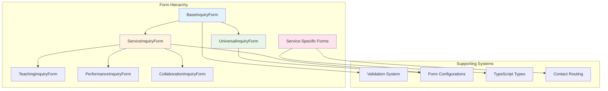
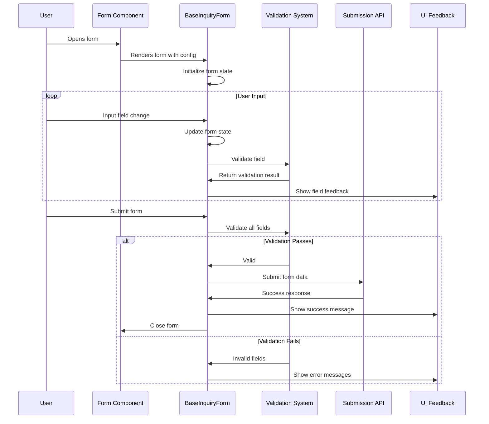
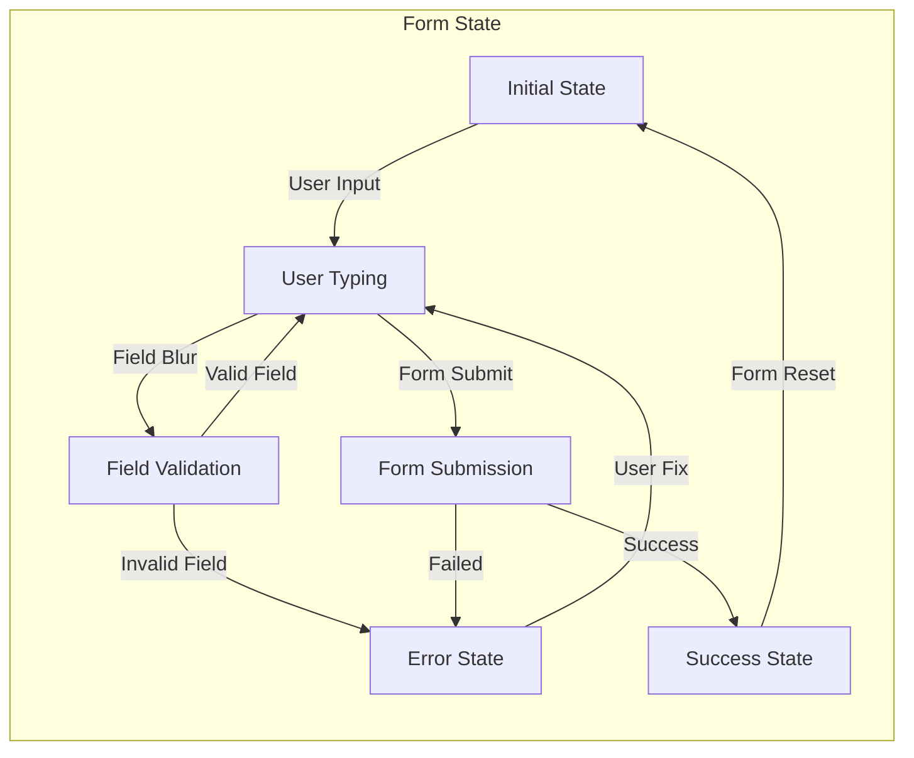
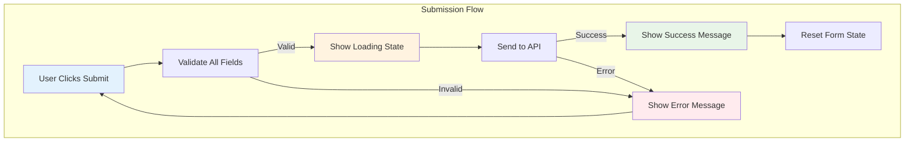

# Form Data Flow Documentation

This document details how form data flows through the RrishMusic application, from user input to validation, submission, and feedback.

## 📋 Table of Contents

- [Form Architecture Overview](#form-architecture-overview)
- [Form Types and Hierarchy](#form-types-and-hierarchy)
- [Data Flow Patterns](#data-flow-patterns)
- [Validation System](#validation-system)
- [Submission Pipeline](#submission-pipeline)
- [Error Handling](#error-handling)
- [Performance Optimizations](#performance-optimizations)

## 🏗️ Form Architecture Overview

The form system follows a **hierarchical component pattern** with shared validation and submission logic:



## 📝 Form Types and Hierarchy

### Base Form Component

**File**: `src/components/forms/BaseInquiryForm.tsx`

```typescript
interface BaseInquiryFormProps<T extends InquiryData> {
  isOpen: boolean
  onClose: () => void
  title: string
  submitButtonText?: string
  initialData?: Partial<T>
  validationRules: ValidationRules<T>
  onSubmit: (data: T) => Promise<void>
}

export function BaseInquiryForm<T extends InquiryData>({
  isOpen,
  onClose, 
  title,
  submitButtonText = 'Send Message',
  initialData = {},
  validationRules,
  onSubmit
}: BaseInquiryFormProps<T>) {
  // Base form logic, validation, and submission handling
}
```

### Service-Specific Forms

#### Teaching Inquiry Form
```typescript
// src/components/forms/TeachingInquiryForm.tsx
interface TeachingInquiryData extends InquiryData {
  experience: 'beginner' | 'intermediate' | 'advanced'
  lessonType: 'individual' | 'group' | 'online'
  goals: string[]
  availability: string
}

export const TeachingInquiryForm: React.FC<TeachingInquiryFormProps> = ({
  isOpen,
  onClose
}) => {
  const validationRules: ValidationRules<TeachingInquiryData> = {
    experience: { required: true },
    lessonType: { required: true },
    goals: { minLength: 1 },
    availability: { required: true }
  }
  
  return (
    <BaseInquiryForm
      isOpen={isOpen}
      onClose={onClose}
      title="Book Guitar Lessons"
      validationRules={validationRules}
      onSubmit={handleTeachingSubmission}
    />
  )
}
```

#### Performance Inquiry Form
```typescript
// src/components/forms/PerformanceInquiryForm.tsx
interface PerformanceInquiryData extends InquiryData {
  eventType: 'wedding' | 'corporate' | 'private' | 'festival'
  venue: string
  date: string
  duration: string
  audience: number
  specialRequests: string
}
```

#### Collaboration Inquiry Form
```typescript
// src/components/forms/CollaborationInquiryForm.tsx
interface CollaborationInquiryData extends InquiryData {
  projectType: 'recording' | 'songwriting' | 'live' | 'composition'
  timeline: string
  budget: string
  description: string
}
```

## 🔄 Data Flow Patterns

### Complete Form Lifecycle



### State Management Flow



### Form State Structure

```typescript
interface FormState<T extends InquiryData> {
  data: T
  errors: Partial<Record<keyof T, string>>
  touched: Partial<Record<keyof T, boolean>>
  isSubmitting: boolean
  isValid: boolean
  submitCount: number
}

// Example state during form interaction
const exampleFormState: FormState<TeachingInquiryData> = {
  data: {
    name: 'John Smith',
    email: 'john@example.com',
    phone: '555-1234',
    experience: 'beginner',
    lessonType: 'individual',
    goals: ['learn basics'],
    availability: 'weekends'
  },
  errors: {
    email: '', // No error - valid email
    phone: 'Phone number format invalid'
  },
  touched: {
    name: true,
    email: true, 
    phone: true,
    experience: false // Not touched yet
  },
  isSubmitting: false,
  isValid: false, // Due to phone error
  submitCount: 0
}
```

## ✅ Validation System

### Validation Rules Configuration

**File**: `src/components/forms/formConfigurations.ts`

```typescript
interface ValidationRule {
  required?: boolean
  minLength?: number
  maxLength?: number
  pattern?: RegExp
  custom?: (value: any) => string | null
}

type ValidationRules<T> = Partial<Record<keyof T, ValidationRule>>

// Example validation configurations
export const teachingValidationRules: ValidationRules<TeachingInquiryData> = {
  name: { 
    required: true, 
    minLength: 2,
    maxLength: 50 
  },
  email: { 
    required: true, 
    pattern: /^[^\s@]+@[^\s@]+\.[^\s@]+$/ 
  },
  phone: { 
    pattern: /^\+?[\d\s-()]+$/,
    custom: (value) => validatePhoneNumber(value)
  },
  experience: { 
    required: true 
  },
  goals: { 
    minLength: 1,
    custom: (goals) => goals.length === 0 ? 'Please select at least one goal' : null
  }
}
```

### Real-time Validation Flow

```typescript
// src/components/forms/BaseInquiryForm.tsx
const validateField = useCallback((
  fieldName: keyof T, 
  value: any, 
  rules: ValidationRule
): string => {
  // Required validation
  if (rules.required && (!value || value.toString().trim() === '')) {
    return `${fieldName} is required`
  }
  
  // Length validation
  if (value && rules.minLength && value.toString().length < rules.minLength) {
    return `${fieldName} must be at least ${rules.minLength} characters`
  }
  
  if (value && rules.maxLength && value.toString().length > rules.maxLength) {
    return `${fieldName} must not exceed ${rules.maxLength} characters`
  }
  
  // Pattern validation
  if (value && rules.pattern && !rules.pattern.test(value.toString())) {
    return `${fieldName} format is invalid`
  }
  
  // Custom validation
  if (value && rules.custom) {
    const customError = rules.custom(value)
    if (customError) return customError
  }
  
  return ''
}, [])

// Field change handler with validation
const handleFieldChange = useCallback((fieldName: keyof T, value: any) => {
  setFormState(prev => {
    const newData = { ...prev.data, [fieldName]: value }
    const fieldError = validateField(fieldName, value, validationRules[fieldName] || {})
    const newErrors = { ...prev.errors, [fieldName]: fieldError }
    
    return {
      ...prev,
      data: newData,
      errors: newErrors,
      isValid: Object.values(newErrors).every(error => !error)
    }
  })
}, [validateField, validationRules])
```

### Advanced Validation Features

#### Cross-Field Validation
```typescript
const validateFormData = (data: TeachingInquiryData): Record<string, string> => {
  const errors: Record<string, string> = {}
  
  // Individual field validation
  Object.entries(teachingValidationRules).forEach(([field, rules]) => {
    const error = validateField(field as keyof TeachingInquiryData, data[field], rules)
    if (error) errors[field] = error
  })
  
  // Cross-field validation
  if (data.lessonType === 'online' && !data.email) {
    errors.email = 'Email is required for online lessons'
  }
  
  if (data.experience === 'advanced' && !data.goals.includes('performance')) {
    errors.goals = 'Advanced students typically need performance goals'
  }
  
  return errors
}
```

#### Async Validation
```typescript
const validateEmailAvailability = async (email: string): Promise<string> => {
  if (!email) return ''
  
  try {
    const response = await fetch('/api/validate-email', {
      method: 'POST',
      headers: { 'Content-Type': 'application/json' },
      body: JSON.stringify({ email })
    })
    
    const result = await response.json()
    return result.isValid ? '' : 'Email is already registered'
  } catch (error) {
    console.warn('Email validation failed:', error)
    return '' // Don't block form submission on validation service failure
  }
}
```

## 🚀 Submission Pipeline

### Service-Specific Submission Handlers

```typescript
// src/utils/contactRouting.ts
export const handleTeachingSubmission = async (data: TeachingInquiryData): Promise<void> => {
  try {
    // Pre-submission processing
    const processedData = {
      ...data,
      service: 'teaching' as const,
      timestamp: new Date().toISOString(),
      source: 'website-form',
      priority: calculatePriority(data),
      metadata: {
        experience: data.experience,
        lessonType: data.lessonType,
        goalCount: data.goals.length
      }
    }
    
    // Submit to backend
    const response = await fetch('/api/inquiries/teaching', {
      method: 'POST',
      headers: {
        'Content-Type': 'application/json',
        'X-Form-Type': 'teaching-inquiry'
      },
      body: JSON.stringify(processedData)
    })
    
    if (!response.ok) {
      throw new Error(`Submission failed: ${response.statusText}`)
    }
    
    // Post-submission actions
    await triggerFollowUpAutomation(processedData)
    await updateAnalytics('form_submission', {
      service: 'teaching',
      experience: data.experience,
      lessonType: data.lessonType
    })
    
  } catch (error) {
    console.error('Teaching form submission error:', error)
    throw new Error('Unable to submit form. Please try again.')
  }
}
```

### Submission State Management



### Error Recovery Patterns

```typescript
const handleSubmission = async (data: T): Promise<void> => {
  const maxRetries = 3
  let retryCount = 0
  
  const attemptSubmission = async (): Promise<void> => {
    try {
      await onSubmit(data)
      
      // Success actions
      setFormState(prev => ({
        ...prev,
        isSubmitting: false,
        submitCount: prev.submitCount + 1
      }))
      
      // Show success message and close form
      showSuccessMessage()
      setTimeout(onClose, 2000)
      
    } catch (error) {
      retryCount++
      
      if (retryCount < maxRetries && isRetriableError(error)) {
        // Wait with exponential backoff
        await new Promise(resolve => setTimeout(resolve, 1000 * Math.pow(2, retryCount)))
        return attemptSubmission()
      }
      
      // Final failure
      setFormState(prev => ({
        ...prev,
        isSubmitting: false,
        errors: {
          ...prev.errors,
          _form: getErrorMessage(error)
        }
      }))
    }
  }
  
  await attemptSubmission()
}
```

## 🎯 Error Handling

### Error Types and Handling

```typescript
interface FormError {
  type: 'validation' | 'submission' | 'network' | 'server'
  field?: keyof T
  message: string
  recoverable: boolean
}

const handleFormError = (error: FormError) => {
  switch (error.type) {
    case 'validation':
      // Show field-specific error
      setFieldError(error.field!, error.message)
      break
      
    case 'network':
      // Show retry option
      showNetworkError(error.message, () => retrySubmission())
      break
      
    case 'server':
      // Show general error with contact info
      showServerError('Please try again or contact support')
      break
      
    case 'submission':
      // Show form-level error
      showSubmissionError(error.message)
      break
  }
}
```

### User-Friendly Error Messages

```typescript
const getErrorMessage = (error: unknown): string => {
  if (error instanceof Error) {
    // Map technical errors to user-friendly messages
    const errorMappings: Record<string, string> = {
      'Network request failed': 'Please check your internet connection and try again.',
      'Validation failed': 'Please check your information and try again.',
      'Server error': 'We\'re experiencing technical difficulties. Please try again in a few minutes.',
      'Rate limit exceeded': 'Too many requests. Please wait a moment before trying again.'
    }
    
    return errorMappings[error.message] || 'An unexpected error occurred. Please try again.'
  }
  
  return 'An unexpected error occurred. Please try again.'
}
```

## ⚡ Performance Optimizations

### Form Component Optimization

```typescript
// Memoize form components to prevent unnecessary re-renders
export const TeachingInquiryForm = React.memo<TeachingInquiryFormProps>(({
  isOpen,
  onClose
}) => {
  // Memoize expensive validations
  const validationRules = useMemo((): ValidationRules<TeachingInquiryData> => ({
    experience: { required: true },
    lessonType: { required: true },
    goals: { 
      minLength: 1,
      custom: (goals: string[]) => goals.length === 0 ? 'Select at least one goal' : null
    }
  }), [])
  
  // Memoize submission handler
  const handleSubmit = useCallback(async (data: TeachingInquiryData) => {
    await handleTeachingSubmission(data)
  }, [])
  
  if (!isOpen) return null
  
  return (
    <BaseInquiryForm
      isOpen={isOpen}
      onClose={onClose}
      title="Book Guitar Lessons"
      validationRules={validationRules}
      onSubmit={handleSubmit}
    />
  )
})
```

### Debounced Validation

```typescript
const useDebouncedValidation = (
  value: any,
  validator: (value: any) => string,
  delay: number = 300
) => {
  const [error, setError] = useState<string>('')
  
  useEffect(() => {
    const timer = setTimeout(() => {
      const validationError = validator(value)
      setError(validationError)
    }, delay)
    
    return () => clearTimeout(timer)
  }, [value, validator, delay])
  
  return error
}
```

### Lazy Form Loading

```typescript
// Lazy load heavy form components
const TeachingInquiryForm = lazy(() => import('./TeachingInquiryForm'))
const PerformanceInquiryForm = lazy(() => import('./PerformanceInquiryForm'))
const CollaborationInquiryForm = lazy(() => import('./CollaborationInquiryForm'))

// Use with Suspense
<Suspense fallback={<FormSkeleton />}>
  {formType === 'teaching' && (
    <TeachingInquiryForm isOpen={isOpen} onClose={closeForm} />
  )}
</Suspense>
```

## 🐛 Debugging Form Data Flow

### Development Debugging

```typescript
// Debug form state in development
const useFormDebugging = <T>(formState: FormState<T>, formName: string) => {
  useEffect(() => {
    if (process.env.NODE_ENV === 'development') {
      console.group(`🎯 Form Debug: ${formName}`)
      console.log('Form Data:', formState.data)
      console.log('Errors:', formState.errors)
      console.log('Touched Fields:', formState.touched)
      console.log('Is Valid:', formState.isValid)
      console.log('Is Submitting:', formState.isSubmitting)
      console.groupEnd()
    }
  }, [formState, formName])
}
```

### Common Issues and Solutions

| Issue | Symptoms | Solution |
|-------|----------|----------|
| Form not validating | No error messages shown | Check validation rules configuration |
| Submission hanging | Loading state persists | Add timeout to submission handler |
| Fields not updating | User input not reflected | Verify field change handlers |
| Memory leaks | Form state persists after close | Clear state in cleanup effects |

---

**Related Documentation**:
- [Content System](./content-system.md) - Static content management
- [State Management](./state-management.md) - Application state patterns  
- [External APIs](./external-apis.md) - API integration patterns

**Last Updated**: August 2025