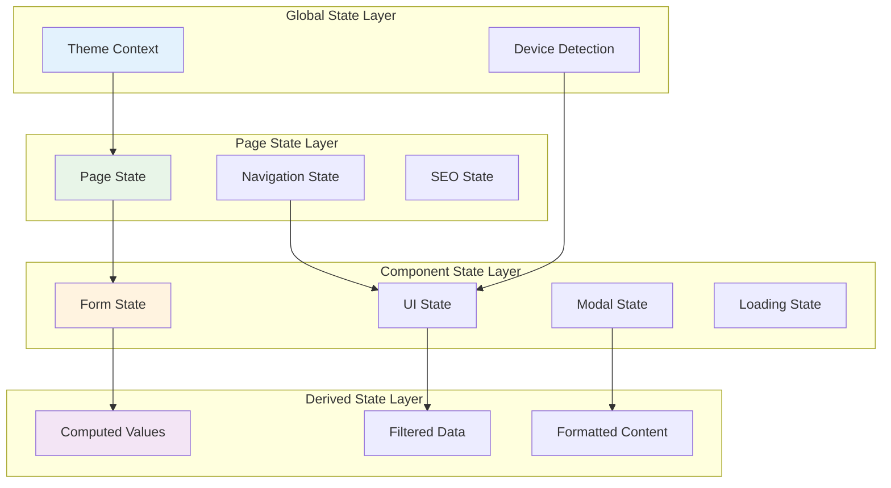
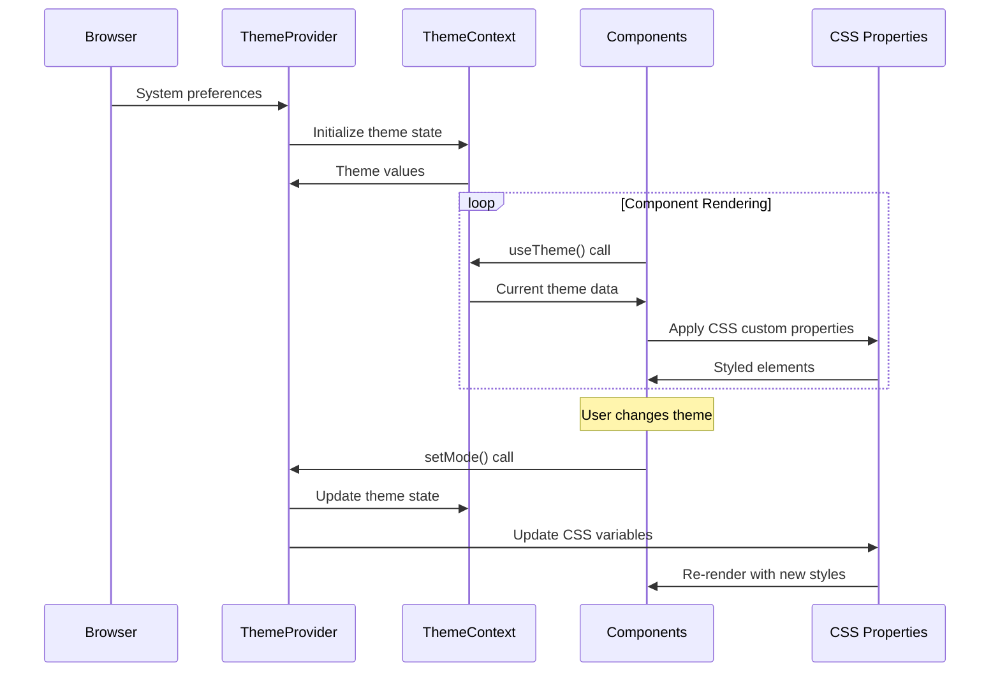

# State Management Data Flow

This document details how application state is managed and flows through the RrishMusic application, including theme context, component state, and global state patterns.

## 📋 Table of Contents

- [State Architecture Overview](#state-architecture-overview)
- [Theme Context System](#theme-context-system)
- [Component State Patterns](#component-state-patterns)
- [Navigation State](#navigation-state)
- [Cross-Component State](#cross-component-state)
- [Performance Considerations](#performance-considerations)
- [Debugging State Issues](#debugging-state-issues)

## 🏗️ State Architecture Overview

The RrishMusic application uses a **hybrid state management approach** combining React Context, local component state, and derived state patterns:



## 🎨 Theme Context System

### Theme Context Architecture

**File**: `src/contexts/ThemeContext.tsx`

The theme system provides global theming state that flows through the entire application:



### Theme State Structure

```typescript
interface ThemeContextValue {
  // Core theme state
  mode: ThemeMode // 'light' | 'dark' | 'auto'
  activeTheme: ActiveTheme // 'light' | 'dark' 
  systemTheme: ActiveTheme
  
  // User preferences
  reducedMotion: boolean
  isInitialized: boolean
  
  // Theme controls
  setMode: (mode: ThemeMode) => void
  toggleTheme: () => void
  
  // CSS utilities
  getCSSProperty: (property: string) => string
  updateCSSProperty: (property: string, value: string) => void
}
```

### Theme Provider Implementation

```typescript
export function ThemeProvider({
  children,
  defaultMode = 'auto',
  enableReducedMotion = true,
  enableSystemDetection = true
}: ThemeProviderProps) {
  
  // Core theme state management
  const [mode, setModeState] = useState<ThemeMode>(() => {
    return getStoredTheme() || defaultMode
  })
  
  const [systemTheme, setSystemTheme] = useState<ActiveTheme>(() => {
    return getSystemPreference()
  })
  
  const [reducedMotion, setReducedMotion] = useState<boolean>(() => {
    return getReducedMotionPreference()
  })
  
  const [isInitialized, setIsInitialized] = useState(false)
  
  // Computed active theme based on mode and system preference
  const activeTheme: ActiveTheme = useMemo(() => {
    if (mode === 'auto') {
      return systemTheme
    }
    return mode as ActiveTheme
  }, [mode, systemTheme])
  
  // Apply theme to DOM
  useEffect(() => {
    applyThemeToDOM(activeTheme, reducedMotion)
    updateColorSchemeMetaTag(activeTheme)
  }, [activeTheme, reducedMotion])
  
  // Listen for system theme changes
  useEffect(() => {
    if (!enableSystemDetection) return
    
    const mediaQuery = window.matchMedia('(prefers-color-scheme: dark)')
    const handleChange = (e: MediaQueryListEvent) => {
      setSystemTheme(e.matches ? 'dark' : 'light')
    }
    
    mediaQuery.addEventListener('change', handleChange)
    return () => mediaQuery.removeEventListener('change', handleChange)
  }, [enableSystemDetection])
  
  // Persist theme preference
  useEffect(() => {
    if (isInitialized) {
      localStorage.setItem(THEME_STORAGE_KEY, mode)
    }
  }, [mode, isInitialized])
}
```

### Theme Usage in Components

```typescript
// Basic theme usage
export const Header: React.FC = () => {
  const { activeTheme, toggleTheme } = useTheme()
  
  return (
    <header className={`header ${activeTheme}`}>
      <button onClick={toggleTheme}>
        {activeTheme === 'dark' ? '☀️' : '🌙'}
      </button>
    </header>
  )
}

// Advanced theme usage with CSS custom properties
export const CustomButton: React.FC = () => {
  const { getCSSProperty, activeTheme } = useTheme()
  
  const buttonStyle: CSSProperties = {
    backgroundColor: getCSSProperty('--color-primary'),
    color: getCSSProperty('--color-primary-foreground'),
    transition: activeTheme === 'light' ? 'all 0.2s ease' : 'all 0.3s ease'
  }
  
  return <button style={buttonStyle}>Custom Button</button>
}
```

## 🧩 Component State Patterns

### Local Component State

The application uses standard React state patterns for component-level state management:

```typescript
// Simple UI state
export const Navigation: React.FC = () => {
  const [isOpen, setIsOpen] = useState(false)
  const [activeSection, setActiveSection] = useState<string | null>(null)
  
  const toggleMenu = useCallback(() => {
    setIsOpen(prev => !prev)
  }, [])
  
  return (
    <nav>
      <button onClick={toggleMenu}>
        {isOpen ? 'Close' : 'Open'} Menu
      </button>
      {isOpen && <MenuContent activeSection={activeSection} />}
    </nav>
  )
}
```

### Complex Component State with useReducer

```typescript
// Complex form state management
interface FormState {
  data: FormData
  errors: ValidationErrors
  touched: TouchedFields
  isSubmitting: boolean
  submitAttempts: number
}

type FormAction = 
  | { type: 'UPDATE_FIELD'; field: string; value: any }
  | { type: 'SET_ERROR'; field: string; error: string }
  | { type: 'SET_SUBMITTING'; isSubmitting: boolean }
  | { type: 'RESET_FORM' }

const formReducer = (state: FormState, action: FormAction): FormState => {
  switch (action.type) {
    case 'UPDATE_FIELD':
      return {
        ...state,
        data: { ...state.data, [action.field]: action.value },
        touched: { ...state.touched, [action.field]: true }
      }
      
    case 'SET_ERROR':
      return {
        ...state,
        errors: { ...state.errors, [action.field]: action.error }
      }
      
    case 'SET_SUBMITTING':
      return {
        ...state,
        isSubmitting: action.isSubmitting,
        submitAttempts: action.isSubmitting ? state.submitAttempts + 1 : state.submitAttempts
      }
      
    case 'RESET_FORM':
      return initialFormState
      
    default:
      return state
  }
}

export const ComplexForm: React.FC = () => {
  const [state, dispatch] = useReducer(formReducer, initialFormState)
  
  const updateField = useCallback((field: string, value: any) => {
    dispatch({ type: 'UPDATE_FIELD', field, value })
  }, [])
  
  return (
    <form>
      {/* Form implementation using state and dispatch */}
    </form>
  )
}
```

### State Lifting Patterns

```typescript
// Parent component manages shared state
interface SharedState {
  selectedService: ServiceType
  inquiryModalOpen: boolean
  currentStep: number
}

export const ServiceSelection: React.FC = () => {
  const [sharedState, setSharedState] = useState<SharedState>({
    selectedService: 'teaching',
    inquiryModalOpen: false,
    currentStep: 0
  })
  
  const updateService = useCallback((service: ServiceType) => {
    setSharedState(prev => ({ ...prev, selectedService: service }))
  }, [])
  
  const openInquiryModal = useCallback(() => {
    setSharedState(prev => ({ ...prev, inquiryModalOpen: true }))
  }, [])
  
  return (
    <div>
      <ServiceCards 
        selectedService={sharedState.selectedService}
        onServiceSelect={updateService}
      />
      <InquiryButton onClick={openInquiryModal} />
      <InquiryModal 
        isOpen={sharedState.inquiryModalOpen}
        service={sharedState.selectedService}
        onClose={() => setSharedState(prev => ({ ...prev, inquiryModalOpen: false }))}
      />
    </div>
  )
}
```

## 🧭 Navigation State

### Route-Based State Management

```typescript
// Navigation state derived from React Router
export const useNavigationState = () => {
  const location = useLocation()
  const navigate = useNavigate()
  
  // Derive navigation state from current route
  const navigationState = useMemo(() => {
    const currentPath = location.pathname
    const currentService = getServiceFromPath(currentPath)
    const breadcrumbs = generateBreadcrumbs(currentPath)
    
    return {
      currentPath,
      currentService,
      breadcrumbs,
      isServicePage: ['teaching', 'performance', 'collaboration'].includes(currentService),
      isHomePage: currentPath === '/'
    }
  }, [location.pathname])
  
  // Navigation actions
  const navigateToService = useCallback((service: ServiceType) => {
    navigate(`/${service}`)
  }, [navigate])
  
  const navigateWithState = useCallback((path: string, state?: any) => {
    navigate(path, { state })
  }, [navigate])
  
  return {
    ...navigationState,
    navigateToService,
    navigateWithState
  }
}
```

### SEO State Management

```typescript
// SEO state updates based on navigation
export const useSEOState = () => {
  const { currentService, currentPath } = useNavigationState()
  const content = useContent()
  
  // Dynamic SEO state based on current page
  const seoState = useMemo(() => {
    const pageContent = currentService ? content[currentService] : content.home
    
    return {
      title: pageContent.seo?.title || pageContent.hero?.title,
      description: pageContent.seo?.description || pageContent.hero?.subtitle,
      keywords: pageContent.seo?.keywords || [],
      canonical: `https://rrishmusic.com${currentPath}`,
      ogImage: pageContent.seo?.ogImage,
      structuredData: generateStructuredData(currentService, pageContent)
    }
  }, [currentService, currentPath, content])
  
  // Apply SEO updates
  useEffect(() => {
    document.title = seoState.title
    updateMetaTags(seoState)
    updateStructuredData(seoState.structuredData)
  }, [seoState])
  
  return seoState
}
```

## 🔄 Cross-Component State

### Custom Hooks for Shared State

```typescript
// Device detection state shared across components
export const useDeviceDetection = () => {
  const [deviceState, setDeviceState] = useState({
    isMobile: false,
    isTablet: false,
    isDesktop: true,
    orientation: 'landscape' as 'portrait' | 'landscape',
    screenSize: { width: window.innerWidth, height: window.innerHeight }
  })
  
  useEffect(() => {
    const updateDeviceState = () => {
      const width = window.innerWidth
      const height = window.innerHeight
      
      setDeviceState({
        isMobile: width < 768,
        isTablet: width >= 768 && width < 1024,
        isDesktop: width >= 1024,
        orientation: width > height ? 'landscape' : 'portrait',
        screenSize: { width, height }
      })
    }
    
    window.addEventListener('resize', updateDeviceState)
    window.addEventListener('orientationchange', updateDeviceState)
    
    return () => {
      window.removeEventListener('resize', updateDeviceState)
      window.removeEventListener('orientationchange', updateDeviceState)
    }
  }, [])
  
  return deviceState
}
```

### Modal State Management

```typescript
// Global modal management
export const useModalManager = () => {
  const [modalStack, setModalStack] = useState<ModalState[]>([])
  
  const openModal = useCallback((modalId: string, props?: any) => {
    setModalStack(prev => [
      ...prev,
      { id: modalId, props, isOpen: true, timestamp: Date.now() }
    ])
  }, [])
  
  const closeModal = useCallback((modalId?: string) => {
    setModalStack(prev => {
      if (modalId) {
        return prev.filter(modal => modal.id !== modalId)
      } else {
        // Close topmost modal
        return prev.slice(0, -1)
      }
    })
  }, [])
  
  const closeAllModals = useCallback(() => {
    setModalStack([])
  }, [])
  
  // Keyboard event handling
  useEffect(() => {
    const handleEscape = (event: KeyboardEvent) => {
      if (event.key === 'Escape' && modalStack.length > 0) {
        closeModal()
      }
    }
    
    document.addEventListener('keydown', handleEscape)
    return () => document.removeEventListener('keydown', handleEscape)
  }, [modalStack.length, closeModal])
  
  return {
    modalStack,
    activeModal: modalStack[modalStack.length - 1] || null,
    hasOpenModals: modalStack.length > 0,
    openModal,
    closeModal,
    closeAllModals
  }
}
```

## ⚡ Performance Considerations

### State Update Optimization

```typescript
// Optimize re-renders with React.memo and stable references
export const OptimizedComponent = React.memo<Props>(({
  data,
  onUpdate
}) => {
  // Use useMemo for expensive computations
  const processedData = useMemo(() => {
    return data.map(item => processItem(item))
  }, [data])
  
  // Use useCallback for stable function references
  const handleClick = useCallback((id: string) => {
    onUpdate(id)
  }, [onUpdate])
  
  return (
    <div>
      {processedData.map(item => (
        <ItemComponent 
          key={item.id} 
          item={item}
          onClick={handleClick}
        />
      ))}
    </div>
  )
})
```

### Context Provider Optimization

```typescript
// Split context to minimize re-renders
const ThemeStateContext = createContext<ThemeState | null>(null)
const ThemeActionsContext = createContext<ThemeActions | null>(null)

export const ThemeProvider: React.FC<{ children: React.ReactNode }> = ({ 
  children 
}) => {
  const [state, setState] = useState<ThemeState>(initialState)
  
  // Memoize actions to prevent re-renders
  const actions = useMemo(() => ({
    setMode: (mode: ThemeMode) => setState(prev => ({ ...prev, mode })),
    toggleTheme: () => setState(prev => ({ 
      ...prev, 
      mode: prev.activeTheme === 'light' ? 'dark' : 'light' 
    }))
  }), [])
  
  return (
    <ThemeStateContext.Provider value={state}>
      <ThemeActionsContext.Provider value={actions}>
        {children}
      </ThemeActionsContext.Provider>
    </ThemeStateContext.Provider>
  )
}
```

### State Normalization

```typescript
// Normalize complex state structures
interface NormalizedTestimonialState {
  byId: Record<string, Testimonial>
  byService: Record<ServiceType, string[]>
  allIds: string[]
  featured: string[]
}

export const useNormalizedTestimonials = () => {
  const rawTestimonials = useTestimonials()
  
  const normalizedState = useMemo((): NormalizedTestimonialState => {
    const byId: Record<string, Testimonial> = {}
    const byService: Record<ServiceType, string[]> = {
      teaching: [],
      performance: [],
      collaboration: []
    }
    const allIds: string[] = []
    const featured: string[] = []
    
    rawTestimonials.forEach(testimonial => {
      byId[testimonial.id] = testimonial
      allIds.push(testimonial.id)
      byService[testimonial.service].push(testimonial.id)
      
      if (testimonial.featured) {
        featured.push(testimonial.id)
      }
    })
    
    return { byId, byService, allIds, featured }
  }, [rawTestimonials])
  
  // Selector functions
  const getTestimonial = useCallback((id: string) => 
    normalizedState.byId[id], [normalizedState.byId]
  )
  
  const getTestimonialsByService = useCallback((service: ServiceType) => 
    normalizedState.byService[service].map(id => normalizedState.byId[id]), 
    [normalizedState.byId, normalizedState.byService]
  )
  
  return {
    ...normalizedState,
    getTestimonial,
    getTestimonialsByService
  }
}
```

## 🐛 Debugging State Issues

### State Debugging Tools

```typescript
// Custom hook for state debugging
export const useStateDebugger = <T>(state: T, label: string) => {
  const prevState = useRef<T>()
  
  useEffect(() => {
    if (process.env.NODE_ENV === 'development') {
      console.group(`🔍 State Debug: ${label}`)
      console.log('Current State:', state)
      console.log('Previous State:', prevState.current)
      
      if (prevState.current) {
        const changes = getStateChanges(prevState.current, state)
        if (Object.keys(changes).length > 0) {
          console.log('Changes:', changes)
        }
      }
      
      console.groupEnd()
      prevState.current = state
    }
  }, [state, label])
}

// Usage in components
export const MyComponent: React.FC = () => {
  const [state, setState] = useState(initialState)
  
  // Debug state changes in development
  useStateDebugger(state, 'MyComponent')
  
  return <div>{/* Component JSX */}</div>
}
```

### Context Debugging

```typescript
// Debug context value changes
export const useTheme = (): ThemeContextValue => {
  const context = useContext(ThemeContext)
  
  if (!context) {
    throw new Error('useTheme must be used within ThemeProvider')
  }
  
  // Debug context changes in development
  useEffect(() => {
    if (process.env.NODE_ENV === 'development') {
      console.log('Theme Context Update:', {
        mode: context.mode,
        activeTheme: context.activeTheme,
        systemTheme: context.systemTheme,
        isInitialized: context.isInitialized
      })
    }
  }, [context])
  
  return context
}
```

### Performance Monitoring

```typescript
// Monitor component re-renders
export const useRenderCount = (componentName: string) => {
  const renderCount = useRef(0)
  
  renderCount.current++
  
  useEffect(() => {
    if (process.env.NODE_ENV === 'development') {
      console.log(`🔄 ${componentName} rendered ${renderCount.current} times`)
    }
  })
  
  return renderCount.current
}
```

### Common State Issues and Solutions

| Issue | Symptoms | Solution |
|-------|----------|----------|
| Excessive re-renders | Performance degradation, console warnings | Use React.memo, useMemo, useCallback |
| Stale closures | State updates don't reflect in callbacks | Use functional state updates |
| Context re-renders | All consumers re-render on any change | Split context by concern |
| Memory leaks | Component state persists after unmount | Clean up in useEffect return function |
| State synchronization | Multiple components out of sync | Lift state up or use context |

### Debug Commands

```bash
# Install React Developer Tools
npm install -g react-devtools

# Profile component performance
npm run dev
# Open React DevTools → Profiler tab → Start profiling

# Check for memory leaks
npm run build
npm run preview
# Open DevTools → Memory tab → Take heap snapshots
```

---

**Related Documentation**:
- [Content System](./content-system.md) - Static content state management
- [Form Data Flow](./forms.md) - Form state patterns
- [External APIs](./external-apis.md) - API state management

**Last Updated**: August 2025